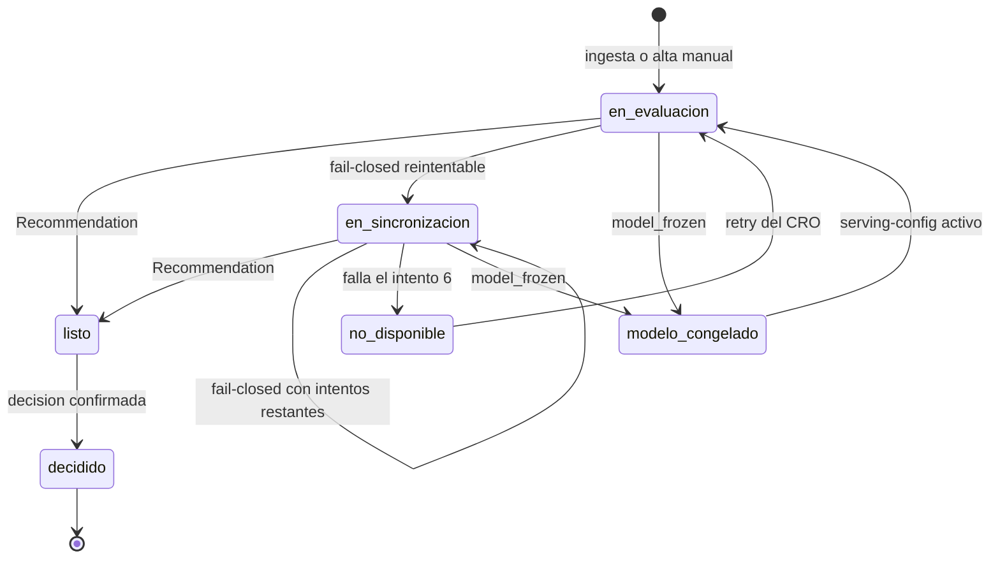

# Modelo de lógica — U8 `case-management`

## 1. Módulos lógicos

| Servicio | Módulo | Responsabilidad | Reglas |
|---|---|---|---|
| case-service | `intake` | Validación, idempotencia, escenarios de prueba, alta manual | BR-U8-01..04 |
| case-service | `case_fsm` | Función pura `transition(state, event) -> state \| Rechazo` | BR-U8-12 |
| case-service | `evaluation` | Worker de la cola: lectura de gobierno, `derive`, `ScoringRequest`, resultado | BR-U8-05..09 |
| case-service | `backoff` | Función pura `schedule(attempt, rng) -> delay` | BR-U8-07 |
| case-service | `sweeps` | Salida de `modelo_congelado` y marca de congelamiento posterior | BR-U8-10, 14 |
| case-service | `decision` | Validación pura (`validate_decision`) y evidencia en dos fases | BR-U8-15..18 |
| case-service | `evidence` | Outbox y reconciliador | BR-U8-09, 18, 19 |
| case-service | `views` | Proyección a `CaseSummary`/`CaseDetail` según el estado | BR-U8-13 |
| case-service | `retention` | Job diario de eliminación | BR-U8-20 |
| case-service | `credit` | Lectura del core con timeout | BR-U8-21 |
| core-banking-mock | `api` | `GET` del crédito; escritura siempre rechazada | BR-U8-22 |

`case_fsm`, `backoff`, `validate_decision` y `views` son funciones puras y se prueban
con propiedades.

## 2. Máquina de estados del caso

### Diagrama



### Alternativa en texto

```text
(nuevo) -> en_evaluacion                      ingesta o alta manual (trabajo en la misma transacción)
en_evaluacion | en_sincronizacion -> listo     Recommendation (guarda registry_entry_id)
en_evaluacion | en_sincronizacion -> en_sincronizacion   fail-closed reintentable o scoring sin respuesta
en_sincronizacion -> no_disponible             falla el intento 6 (alerta + entrada fail_closed única)
en_evaluacion | en_sincronizacion -> modelo_congelado    FailClosed(model_frozen)
modelo_congelado -> en_evaluacion              barrido cada 5 min: serving-config activo
no_disponible -> en_evaluacion                 retry del CRO
listo -> decidido                              decisión confirmada en el registro (terminal)
listo nunca vuelve a evaluarse.
```

## 3. Flujos

### 3.1 Intento de evaluación

```text
worker: toma evaluation_jobs (FOR UPDATE SKIP LOCKED, locked_until = ahora + 30 s)
  serving-config (F104, caché <= 5 s)   falla -> resultado serving_config_unavailable
  feature-spec de esa versión (F104, caché por versión)
  derive(application + identificadores, ahora, feature_spec) -> FeatureVector, MonitoringLabels
  POST /v1/recommendations (F15, timeout 7 s)
      ScoringRequest {case_id, features, monitoring_labels, policy_inputs, attempt, model_version_id}
  resultado -> BR-U8-08 (en una transacción: estado + reprogramación o borrado del trabajo)
  intento 6 fallido -> no_disponible + evidence_outbox(fail_closed, retryable=false)
```

### 3.2 Decisión

```text
BFF (analista) -> POST /v1/cases/{id}/decision (DecisionIn)
  validate_decision(DecisionIn, recommendation) -> 422 | ok        (BR-U8-16, BR-U0-35, BR-U0-36)
  ¿caso listo y sin otra decisión? no -> 409
  tx: decisions(pendiente_registro) + evidence_outbox(human_decision, idempotency_key)
  append F16 -> ack:    tx: confirmada + caso decidido -> 200 DecisionRef
             -> sin ack: 503; el reconciliador reintenta con la misma llave y luego confirma
```

### 3.3 Consulta de la explicación

```text
BFF (analista) -> POST /v1/cases/{id}/explanation-views
  ¿listo o decidido? no -> 409
  ¿existe (case_id, user_id)? sí -> 204
  tx: explanation_views + evidence_outbox(explanation_view, UUIDv5(case_id, user_id))
  append F16 (o reconciliador) -> 204
```

## 4. Propiedades testeables (PBT-01)

| ID | Componente | Propiedad | Categoría | Generadores (PBT-07) |
|---|---|---|---|---|
| PBT-U8-01 | `case_fsm` + `evaluation` | **Stateful (PBT-06)**, para toda secuencia de eventos (resultados de scoring de cada tipo, scoring sin respuesta, congelar y descongelar, `retry`, decisión con y sin ack del registro, reconciliador), contra un modelo de referencia: el estado siempre es alcanzable por BR-U8-12; `listo` nunca recibe otro intento; `decidido` es terminal; hay como máximo una decisión `confirmada`; un caso en `en_evaluacion` o `en_sincronizacion` siempre tiene exactamente un trabajo vivo; `attempts ≤ 6` | Stateful | Secuencias de 1 a 50 comandos con resultados de los 10 tipos de `cause`, `Recommendation` y fallos de transporte |
| PBT-U8-02 | `backoff` | Para todo intento 1..5 y toda semilla, el retraso está en `[0,8; 1,2] · 30 s · 2^(n−1)` y la suma de los 5 retrasos es ≤ 1,2 · 930 s | Invariante (cotas) | Intentos y semillas |
| PBT-U8-03 | `decision` | `validate_decision` acepta ⇔ se cumplen BR-U0-35, BR-U0-36 y BR-U8-16, contra un oráculo por tabla de verdad | Oráculo | Productos de `decision` × `outcome` de la recomendación × factores (subconjunto, ajeno, `ninguno`, vacío) × justificaciones de 0 a 2001 caracteres con espacios en los bordes |
| PBT-U8-04 | `views` | Para todo caso en un estado distinto de `listo` y `decidido`, `CaseSummary` y `CaseDetail` no contienen `score`, `outcome`, `recommendation` ni `explanation`; la bandeja nunca contiene identificadores | Invariante | Casos en los 6 estados, con y sin recomendación guardada |
| PBT-U8-05 | `evaluation` | Para toda `ApplicationIn` y todo `FeatureSpec` válido, el `ScoringRequest` no contiene identificadores directos, `free_text` ni `test_scenario_id`; dos solicitudes que solo difieren en `free_text` producen el mismo `ScoringRequest` (RT-1) | Invariante | `ApplicationIn` del generador de U0 (con PII y texto libre adversarial) × `FeatureSpec` con búsquedas |
| PBT-U8-06 | `intake` | Para toda secuencia de envíos con llaves repetidas: misma llave y mismo cuerpo → el mismo `case_id`; misma llave y otro cuerpo → 409; nunca dos casos con la misma llave | Idempotencia | Secuencias de envíos con llaves y cuerpos repetidos |
| PBT-U8-07 | `evidence` | **Stateful (PBT-06)**, para toda secuencia de fallos y éxitos del registro (incluido un ack perdido después del commit): cada evidencia termina `confirmada` exactamente una vez, siempre con la misma `idempotency_key`, y el registro doble tiene una sola entrada por evidencia | Stateful | Secuencias de respuestas del registro: ack, 503, timeout, ack perdido |
| PBT-U8-08 | `retention` | Después del job, ningún caso vencido conserva identificadores ni `free_text`; los no vencidos quedan intactos; correr el job dos veces da el mismo resultado | Invariante + idempotencia | Casos con fechas alrededor de los plazos de 2 y 10 años |

**Pruebas de ejemplo obligatorias (PBT-10):**
- solicitud válida del simulador → caso `en_evaluacion`; solicitud inválida → 4xx sin caso; un caso adversarial queda con su `test_scenario_id` (US-101);
- alta manual de un analista → canal `manual` y su `user_id`; `cumplimiento` → 403 con log de autorización (US-102);
- bandeja con casos en `listo`, `en_sincronizacion`, `no_disponible` y `modelo_congelado`; el `GET` de un caso no listo no trae `score` (US-107);
- decisión `sigue` → entrada `human_decision` con `user_id`, `model_version_id`, `policy_version_id` y `recommendation_entry_id`; decisión sobre un caso `no_disponible` → 409 sin entrada (US-108);
- con reloj simulado: recuperación en el intento 3 → `listo`; 6 fallos → `no_disponible`, gauge = 1, alerta `FailClosedPersistente` y una entrada `fail_closed` (US-112);
- primera consulta de la explicación → una entrada; segunda → 204 sin entrada (US-501);
- `se_aparta` sin factores ni `ninguno` → 422; `sigue` con `["ninguno"]` → aceptada (US-502);
- `POST` al mock con cualquier token → 403 y un `WriteAttempt` (US-603; la prueba de red en kind es de U1 y U12);
- versión pedida distinta de la de scoring → `FailClosed(version_mismatch)` y el caso reintenta (Q1).

## 5. Cumplimiento de extensiones (Functional Design U8)

Revisada contra el cuerpo de los tres artefactos antes de presentarla.

| Regla | Estado | Evidencia |
|---|---|---|
| AUTONOMIA-03 | Cumple | BR-U8-21, 22: solo lectura del core; la escritura del mock existe solo para RT-5 y siempre se rechaza |
| AUTONOMIA-05 | Cumple | BR-U8-06 y PBT-U8-05: ni identificadores ni `free_text` salen hacia scoring; F104 y F17 son internos al clúster |
| AUTONOMIA-06 | Cumple | BR-U8-08, 12, 13: un caso solo es `listo` con una `Recommendation` registrada; los fail-closed nunca muestran un score; BR-U8-05 impide puntuar un vector con otra versión |
| SECURITY-03 | Cumple | BR-U8-03, 19: `test_scenario_id` fuera de los logs de negocio; eventos sin PII del solicitante |
| SECURITY-05 | Cumple | BR-U8-01, 02, 16 (validación de entradas y de la decisión) |
| SECURITY-08 | Cumple | BR-U8-04, 11, 15, 19 (rol por operación y reglas de objeto: estado del caso, decisión a nombre del llamante) |
| SECURITY-11 | Cumple | Casos de abuso con prueba: escritura al core (BR-U8-22, RT-5), conjunto adversarial y cabecera de escenario en producción (BR-U8-03), llave de idempotencia reutilizada con otro cuerpo (BR-U8-02, PBT-U8-06), `free_text` adversarial (PBT-U8-05, RT-1) |
| SECURITY-13 | Cumple | BR-U8-18 y PBT-U8-07: la decisión solo vale si quedó en el registro, con una sola entrada por evidencia; `recommendation_entry_id` liga la decisión con la recomendación entregada (P-U7-03) |
| SECURITY-15 | Cumple | BR-U8-08 (todo fallo de scoring es reintentable y nunca un score), BR-U8-21 (el core caído no rompe la vista), 503 con la decisión pendiente (BR-U8-18) |
| PBT-01 | Cumple | §4 |
| PBT-06 | Cumple | PBT-U8-01 y PBT-U8-07 (stateful) |
| PBT-07 | Cumple | Columna «Generadores» de §4 |
| PBT-10 | Cumple | Pruebas de ejemplo de §4, una o más por historia |
