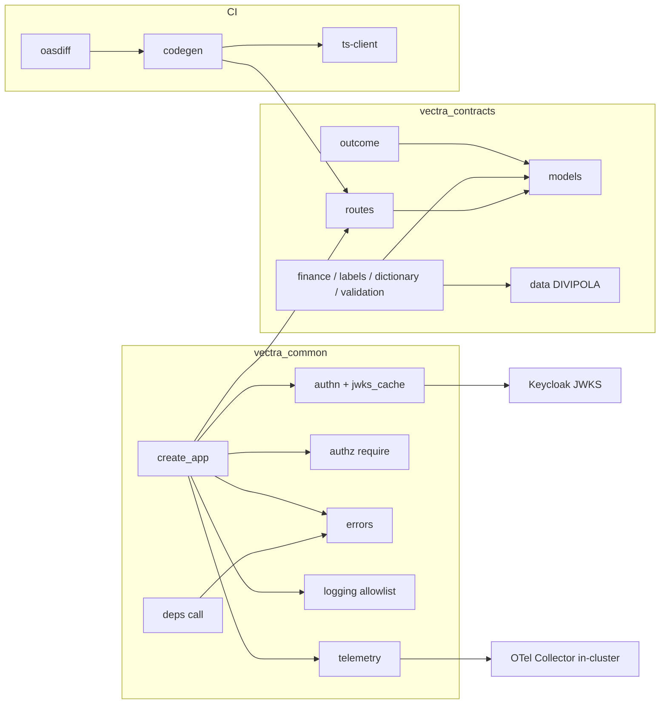

# Componentes lógicos — U0 `contracts`

U0 no despliega componentes. Sus componentes lógicos son módulos de librería que se
ejecutan **dentro** de cada servicio, más herramientas de CI. No hay colas, caches
compartidos ni bases de datos nuevas.

---

## 1. Inventario

| Componente | Paquete | Tipo | Patrón | Estado en runtime |
|---|---|---|---|---|
| `routes` (registro de contratos) | `vectra_contracts` | Datos declarativos | P-U0-12 | Inmutable |
| `models` (tipos de dominio y de API) | `vectra_contracts` | Pydantic v2 strict | P-U0-03 | — |
| `outcome` (`check_preconditions`, `build_outcome`) | `vectra_contracts` | Funciones puras | P-U0-03 | — |
| `finance`, `labels`, `dictionary`, `validation` | `vectra_contracts` | Funciones puras | P-U0-10 | — |
| `data` (DIVIPOLA, regiones) | `vectra_contracts` | Archivos con checksum | NFR-U0-20 | Cargado una vez, inmutable |
| `app_factory` (`create_app`) | `vectra_common` | Fábrica ASGI | P-U0-01, P-U0-12 | — |
| `authn` + `jwks_cache` | `vectra_common` | Middleware + cache | P-U0-06 | Cache en memoria por proceso |
| `authz` (`require`) | `vectra_common` | Dependencia de FastAPI | P-U0-02 | — |
| `errors` (`VectraError`, `ProblemHandler`) | `vectra_common` | Jerarquía + handler | P-U0-05 | — |
| `deps` (`call`) | `vectra_common` | Helper HTTP con timeout | P-U0-07 | Usa el cliente `httpx` del servicio |
| `logging` (`allowlist_filter`) | `vectra_common` | Procesador de structlog | P-U0-04 | — |
| `telemetry` (OTel + `SpanAllowlist`) | `vectra_common` | Configuración + procesador | P-U0-11 | Exportador OTLP hacia el Collector in-cluster |
| `metrics` | `vectra_common` | Contadores Prometheus | P-U0-04, 06; BR-U0-73 | Registro por proceso, expuesto en 8081 |
| `ts-client` | `contracts/ts` | Tipos generados + `openapi-fetch` | NFR-U0-34 | En el navegador (SPA) |
| `strategies` | `contracts/tests` | Generadores Hypothesis | NFR-U0-44 | Solo en pruebas |
| `codegen` (specs, realm, matriz) | herramienta de CI | Script | P-U0-12 | Solo en CI |
| `compat` (`oasdiff`) | herramienta de CI | Binario | NFR-U0-33 | Solo en CI |
| `bench` | herramienta de CI | `pytest-benchmark` | P-U0-09 | Solo en CI |

## 2. Métricas que emite U0 (dentro de cada servicio)

| Métrica | Etiquetas | Origen |
|---|---|---|
| `vectra_authz_denied_total` | `code`, `route_template` | BR-U0-73 |
| `vectra_jwks_refresh_total` | `result` (`ok`, `error`, `throttled`) | P-U0-06 |
| `vectra_log_fields_dropped_total` | `service`, `event` | P-U0-04 |

Ninguna etiqueta lleva identificadores de usuario ni de caso (cardinalidad acotada,
sin PII).

## 3. Dependencias

### Diagrama



### Alternativa en texto

```text
vectra_contracts  (no depende de vectra_common; sin E/S)
  routes   -> models
  outcome  -> models
  finance, labels, dictionary, validation -> models, data (DIVIPOLA)

vectra_common     (depende de vectra_contracts, nunca al revés)
  create_app -> routes, authn, authz, errors, logging, telemetry
  authn      -> Keycloak JWKS (HTTPS, timeout 2 s, single-flight)
  telemetry  -> OTel Collector in-cluster (OTLP)
  deps       -> errors

CI
  codegen -> routes  => contracts/openapi/*.yaml, catálogo para U2, matriz US-602
  codegen -> ts-client (openapi-typescript)
  oasdiff -> specs generadas vs. última etiqueta contracts-vX.Y.Z
```

### Reglas de dependencia (import-linter)
- `vectra_contracts` **no** importa `vectra_common`, `fastapi`, `httpx` ni módulos de E/S (NFR-U0-22).
- Solo `outcome` importa `vectra_contracts.outcome._internal` (P-U0-03).
- Los servicios importan `vectra_common.create_app` y nunca `fastapi.FastAPI` (P-U0-01).
- Solo `vectra_common.deps` importa `httpx` para llamadas salientes (P-U0-07).

## 4. Dependencias externas en runtime

| Dependencia | Quién la llama | Protocolo | Timeout | Si falla |
|---|---|---|---|---|
| Keycloak (JWKS, F50) | `authn` | HTTPS | 2 s | Cache vigente; si no hay → 503 `dependency_unavailable` |
| OTel Collector (F61) | `telemetry` | OTLP/gRPC | Exportación asíncrona en batch | Se descartan spans; nunca bloquea la request |

No hay ninguna otra llamada saliente desde U0 (AUTONOMIA-05).
