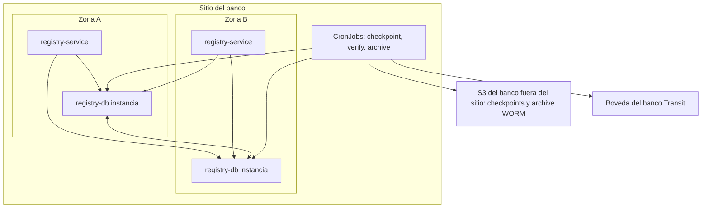

# Arquitectura de despliegue — U3 `decision-registry`

Vista de producción (staging igual; kind con MinIO y Vault dev en lugar del S3 y la bóveda
del banco).

---

## 1. Topología

### Diagrama



### Alternativa en texto

```text
Sitio del banco
  Zona A / Zona B: decision-registry-service (2..6, spread por zona)
                   registry-db (3 instancias, réplica síncrona; -rw primaria, -ro réplicas)
  Servicio -> -rw: append (2), dossier (1), health (1)   ; -> -ro: projections (1)
  CronJobs:
    registry-checkpoint (hora)  -> -rw ; bóveda (F99, firma) ; S3 checkpoints (F77)
    registry-verify-* (15 min / noche / mes) -> -ro ; S3 checkpoints (F79, lectura)
    registry-archive (mes)      -> -ro ; bóveda (F99) ; S3 archive (F78)
Fuera del sitio: S3 del banco (WORM COMPLIANCE, 10 años) ; bóveda del banco (Transit, llave no exportable)
```

## 2. Orden de instalación (waves de U1)

| Wave | Componente de U3 | Requisito previo verificable |
|---|---|---|
| 2 | `registry-db` (U1) | `Cluster in healthy state` con standby síncrono |
| 5 | Job de migración (hook): esquema, particiones, roles y génesis | `SELECT seq, entry_type FROM registry_entries WHERE seq = 0` → `genesis` |
| 5 | `decision-registry-service` y CronJobs | `/readyz` = 200; un `vectra-registry verify --mode full` manual → `exit 0` |

## 3. Escenarios de resiliencia (RESILIENCY-14 = C)

| Escenario | Resultado esperado |
|---|---|
| Fallo de zona | Escrituras bloqueadas mientras CloudNativePG reclona (NFR-U1-03); readiness falla (P-U3-01); los llamadores salen como fail-closed; nunca un ack sin commit síncrono |
| Pérdida del sitio | Restore (U1) + `verify --mode full` contra los checkpoints del S3 externo (sobreviven, INF-U3-01) |
| Bóveda caída | Appends normales; checkpoint atrasado → `CheckpointMissing` |
| S3 externo caído | Checkpoint en la cadena; exportación reintentada → `CheckpointExportFailed`; archivo del mes pendiente → `ArchiveExportFailed` |
| Manipulación directa en la base | `incremental` o `nightly` → `RegistryChainBroken` (SEV1) por checkpoint |

Se documentan aquí y se ejecutan en Operations.
