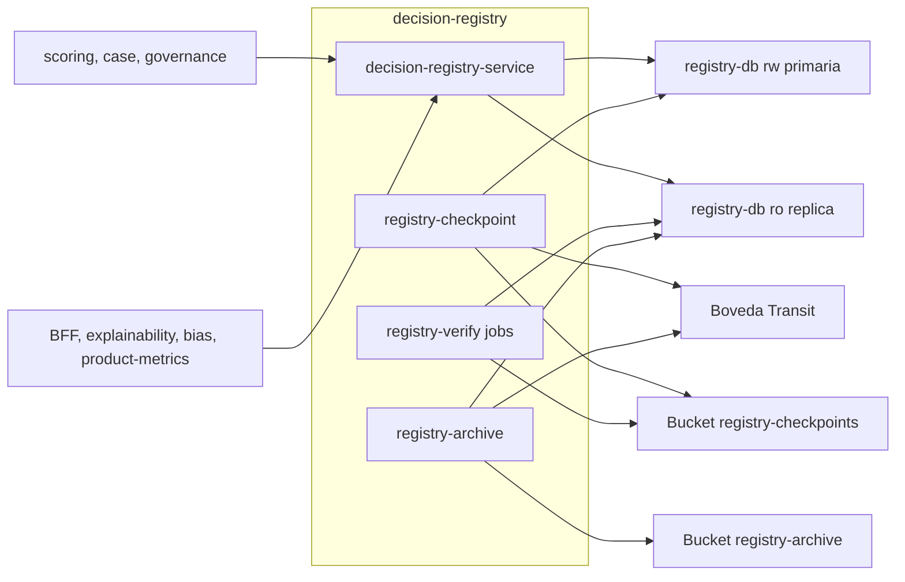

# Componentes lógicos — U3 `decision-registry`

---

## 1. Inventario

| Componente | Tipo | Función | Patrón | PriorityClass |
|---|---|---|---|---|
| `decision-registry-service` | Deployment (≥ 2, por zona, HPA) | API: append, proyecciones, expediente, verificación bajo demanda | P-U3-01, 02, 04 | `vectra-critical` |
| `registry-checkpoint` | CronJob (cada hora) | Firma, encadena y exporta checkpoints | P-U3-03 | `vectra-high` |
| `registry-verify-incremental` | CronJob (cada 15 min) | Verificación `incremental` en la réplica | P-U3-05 | `vectra-normal` |
| `registry-verify-nightly` | CronJob (cada noche) | Verificación `nightly` en la réplica | P-U3-05 | `vectra-normal` |
| `registry-verify-full` | CronJob (mensual, domingo 02:00) | Verificación `full` en la réplica | P-U3-05 | `vectra-low` |
| `registry-archive` | CronJob (mensual) | Export de 10 años con verificación | P-U3-07 | `vectra-low` |
| Job de migración | Job (hook de sync) | DDL y particiones (F44) | P-U3-06 | `vectra-normal` |
| `vectra-registry` (CLI) | Binario del paquete | `verify` y `checkpoint`; la usan los CronJobs y `restore-drill` | BR-U3-11 | — |
| `registry-db` | Cluster de CloudNativePG (U1) | Primaria + 2 réplicas; servicios `-rw` y `-ro` | NFR-U3-10 | `vectra-critical` |
| Bucket `registry-checkpoints` | WORM | Copia de los checkpoints | BR-U3-08 | — |
| Bucket `registry-archive` | WORM, 10 años | Archivo mensual | P-U3-07 | — |
| Bóveda (Transit) | Externa a U3 | Firma Ed25519 | P-U3-03, 07 | — |

## 2. Dependencias

### Diagrama



### Alternativa en texto

```text
scoring, case, governance -> decision-registry-service (append) -> registry-db -rw (pool append, 2)
BFF, explainability, bias, product-metrics -> decision-registry-service
   expediente   -> registry-db -rw (pool dossier, 1)
   proyecciones -> registry-db -ro (pool projections, 1)
registry-checkpoint (cada hora) -> registry-db -rw (append) ; bóveda (firma) ; bucket registry-checkpoints
registry-verify-* (15 min / noche / mes) -> registry-db -ro ; bucket registry-checkpoints (comparación)
registry-archive (mes) -> registry-db -ro ; bóveda (firma del manifiesto) ; bucket registry-archive (10 años)
readiness del servicio -> registry-db -rw con registry_health (standby síncrono presente)
```

## 3. Pendiente para el Infrastructure Design de U3 (resuelto en INF-U3-01..06)
- Dónde viven los buckets WORM (MinIO in-cluster o almacenamiento fuera del sitio) y sus flujos.
- Flujos hacia la bóveda (Vault in-cluster en kind; bóveda del banco en prod, egress).
- Flujos al servicio `-ro` de `registry-db` y RBAC de los CronJobs.
- Recursos iniciales del servicio y de los CronJobs.
