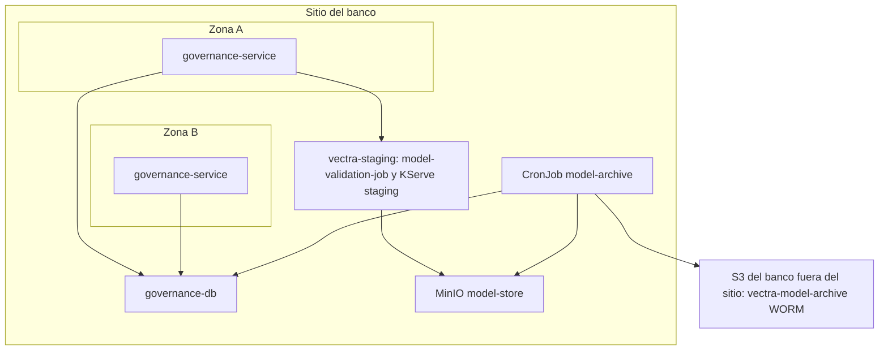

# Arquitectura de despliegue — U4 `governance`

Vista de producción (staging igual; kind con MinIO en lugar del S3 del banco).

---

## 1. Topología

### Diagrama



### Alternativa en texto

```text
Sitio del banco
  Zona A / Zona B: governance-service (2..6, spread por zona; serving-config en memoria; LISTEN/NOTIFY)
  governance-db (CloudNativePG, U1)
  vectra-staging: model-validation-job (K01) -> KServe staging, model-store (lectura)
  model-archive (CronJob diario) -> model-store (F101) ; S3 fuera del sitio (F100) ; governance-db (F102)
Fuera del sitio: S3 del banco, bucket vectra-model-archive (WORM COMPLIANCE, 10 años)
```

## 2. Orden de instalación (waves de U1)

| Wave | Componente de U4 | Requisito previo verificable |
|---|---|---|
| 2 | `governance-db` (U1) | `Cluster in healthy state` |
| 5 | Job de migración (hook): esquema, triggers de P-U4-06, rol `gov_archiver` | Prueba SQL de los triggers en el PR (Testcontainers) |
| 5 | `governance-service`, `model-archive` | `/readyz` = 200 (copia de `serving-config` cargada) |

## 3. Escenarios de resiliencia (RESILIENCY-14 = C)

| Escenario | Resultado esperado |
|---|---|
| Caída de una réplica | La otra sigue sirviendo `serving-config` desde memoria |
| `governance-db` pausada | `serving-config` sigue respondiendo la última copia (NFR-U4-04); las transiciones devuelven 503 |
| Registro caído | Transiciones pendientes, sin efecto; `freeze` se aplica igual (`FreezeEventPending`) |
| S3 externo caído | `model-archive` reintenta al día siguiente; `ModelArchivePending` a las 48 h |
| Pérdida del sitio | Restore de `governance-db` (U1); los artefactos de versiones activadas se recuperan de `vectra-model-archive` |

Se documentan aquí y se ejecutan en Operations.
