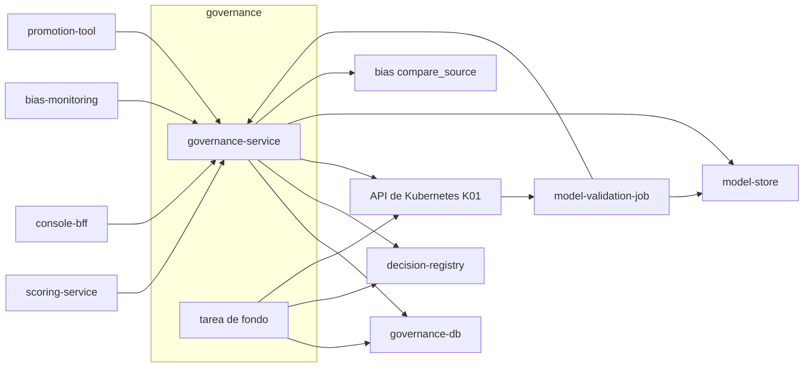

# Componentes lógicos — U4 `governance`

---

## 1. Inventario

| Componente | Tipo | Función | Patrón | PriorityClass |
|---|---|---|---|---|
| `governance-service` | Deployment (≥ 2, por zona, HPA) | API de modelos, políticas, fuentes y `serving-config`; copia en memoria; tarea de fondo | P-U4-01, 02, 04, 05, 07 | `vectra-high` |
| Tarea de fondo (dentro del servicio) | Hilo asíncrono por réplica | Reconciliador, barrido de validaciones, sondeo del `etag`, temporizador de medianoche | P-U4-01, 02, 05 | — |
| `model-validation-job` | Job en `vectra-staging` (K01) | AUC, disparidad inicial, sincronía | P-U4-03 | `vectra-low` |
| `promotion-tool` | CLI en la estación del ingeniero | PR de un commit; `mark_active` | BR-U4-08, 09 | — |
| Job de migración | Job (hook de sync) | Esquema, triggers de P-U4-06 | P-U4-06 | `vectra-normal` |
| `governance-db` | Cluster de CloudNativePG (U1) | Datos de governance; `LISTEN/NOTIFY` | P-U4-01 | `vectra-critical` |
| Script de CI `no-unfreeze-paths` | CI | Busca rutas `congelado → activo` fuera del endpoint | BR-U4-03 | — |
| Script de CI `promotion-pr-check` | CI del repositorio GitOps | Un commit, mismo `model_version_id` en predictor y explicador, evidencia adjunta | BR-U4-09 | — |

## 2. Dependencias

### Diagrama



### Alternativa en texto

```text
scoring -> GET serving-config (desde memoria, If-None-Match)
BFF -> modelos, políticas, fuentes (firmas con MFA)
bias-monitoring -> freeze (solo governance:freeze)
promotion-tool -> list_promotable, mark_active (F08, token de usuario con MFA)
governance-service -> governance-db (tx 2, read 1, listen 1) ; registro (append con idempotency_key)
                   -> API de Kubernetes (K01: crear Job, get, pods/log bajo demanda)
                   -> model-store (verificar checksum, F47) ; bias compare_source (F27)
tarea de fondo -> governance-db (background 1: reconciliador, barridos, sondeo del etag)
               -> registro (reintentos) ; API de Kubernetes (get del Job vencido)
model-validation-job -> model-store (F31) ; KServe staging (F30) ; informe a governance (F32)
```

## 3. Pendiente para el Infrastructure Design de U4 (resuelto en INF-U4-01..04)
- Recursos e HPA del servicio; recursos del Job ya fijados (NFR-U4-23).
- Retención de 10 años en el bucket `model-store` (NFR-U4-31).
- Confirmar que los flujos existentes (F11, F18, F24, F25, F27, F30–F32, F41, F47, K01) cubren todo; no se esperan flujos nuevos.
