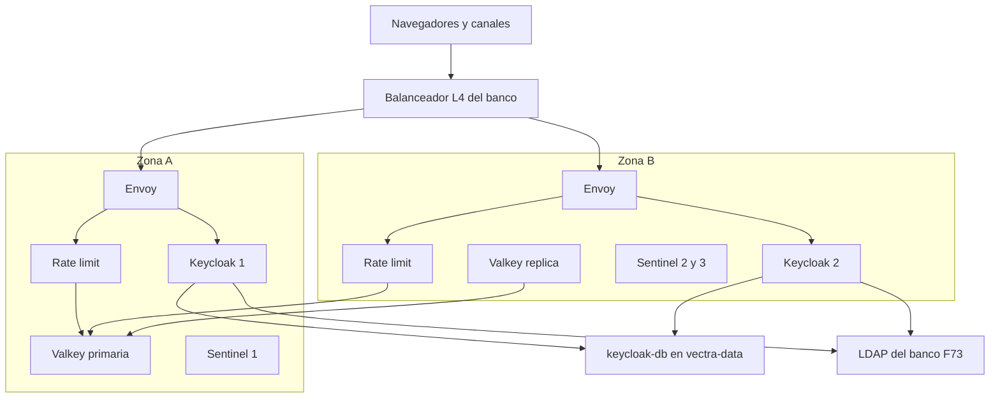

# Arquitectura de despliegue — U2 `identity-edge`

Vista de producción (staging igual; kind con los mismos componentes en 4 workers y 2 zonas
simuladas).

---

## 1. Topología

### Diagrama



### Alternativa en texto

```text
Navegadores y canales -> balanceador L4 del banco (IP real) -> Envoy (2..6, por zona, vectra-edge)
Envoy -> servicio de rate limit (gRPC 8083, 2 réplicas) -> Valkey primaria (Sentinel elige la primaria)
Valkey réplica (otra zona) -> replica desde la primaria; 3 Sentinel repartidos por zona
Envoy -> Keycloak (2..4, por zona, vectra-identity) -> keycloak-db (CloudNativePG, U1)
Keycloak -> LDAP del banco (LDAPS 636, solo prod, F73)
Controlador de Envoy Gateway (envoy-gateway-system, 2 réplicas) -> Envoy (xDS 18000)
```

## 2. Orden de instalación (waves de U1)

| Wave | Componente de U2 | Requisito previo verificable |
|---|---|---|
| 0 | CRDs de Gateway API y controlador de Envoy Gateway | `kubectl get crd gateways.gateway.networking.k8s.io` |
| 2 | Valkey + Sentinel (junto a los datos) | `valkey-cli -h <sentinel> -p 26379 sentinel get-master-addr-by-name ratelimit` responde |
| 3 | Keycloak + `keycloak-config-cli` (hook) | Realm importado; `realm-lint` en verde en el PR |
| 3 | `Gateway`, rutas, políticas y servicio de rate limit | `egctl x status` sin errores; `/auth/admin` → 404 |

## 3. Escenarios de resiliencia (RESILIENCY-14 = C)

| Escenario | Resultado esperado |
|---|---|
| Caída de una zona | Envoy, Keycloak y rate limit siguen en la otra zona; las sesiones persisten (NFR-U2-02); Sentinel promueve la réplica de Valkey si la primaria estaba en la zona caída |
| Valkey caído por completo | `/auth/**` → 503 (fail-closed); consola e ingesta siguen (P-U2-01); alerta `RateLimitBackendDown` |
| Keycloak caído por completo | NFR-U2-05: sin logins ni refresh; tokens vigentes ≤ 5 min; servicios en 503 al vencer la cache de JWKS; `KeycloakDown` SEV1 |
| LDAP del banco caído (prod) | Sin logins nuevos; `LdapUnavailable` SEV2 |
| Controlador de Envoy Gateway caído | Envoy sigue con la última configuración (NFR-U2-04) |

Se documentan aquí y se ejecutan en Operations.
