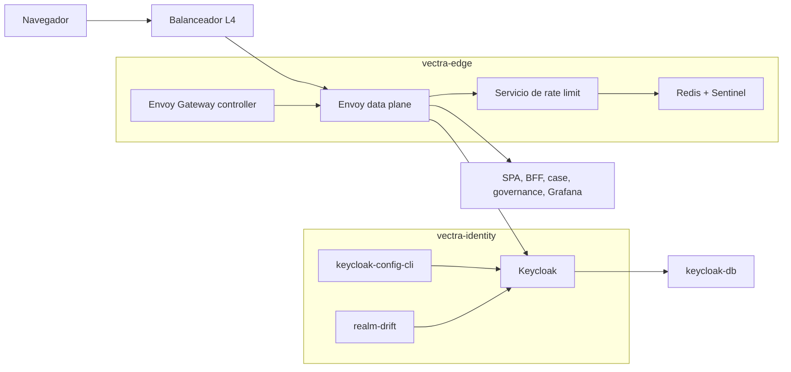

# Componentes lógicos — U2 `identity-edge`

---

## 1. Inventario

| Componente | Namespace | Función | Patrón / NFR | PriorityClass |
|---|---|---|---|---|
| Envoy Gateway (controlador) | `vectra-edge` | Traduce Gateway API a configuración de Envoy | NFR-U2-03, 04 | `vectra-high` |
| Envoy (data plane) | `vectra-edge` | TLS, rutas, JWT, rate limit, cabeceras, access log | P-U2-01..03, 06, 07 | `vectra-high` |
| Servicio de rate limit (`envoyproxy/ratelimit`) | `vectra-edge` | Decisiones de rate limit global | P-U2-01, 06 | `vectra-high` |
| Redis (primaria + réplica + 3 Sentinel) | `vectra-edge` | Contadores efímeros | P-U2-04; NFR-U2-27 | `vectra-high` |
| Keycloak (2–4 réplicas) | `vectra-identity` | IdP: realm `vectra`, MFA, sesiones, eventos | P-U2-04, 05, 08 | `vectra-high` |
| `keycloak-config-cli` (Job, hook de sync) | `vectra-identity` | Aplica `realm.{env}.yaml` | BR-U2-12 | `vectra-normal` |
| `realm-drift` (CronJob diario) | `vectra-identity` | Compara el realm exportado con Git | BR-U2-12 | `vectra-low` |
| Exportador de antigüedad de llaves | `vectra-identity` | Métrica para `SigningKeyAgeHigh` | P-U2-05 | `vectra-low` |
| Tema `vectra` | Imagen de Keycloak | Login en español | P-U2-08 | — |
| `routes.yaml` + `route-gen` | CI | Genera los recursos de Gateway API y Envoy Gateway | BR-U2-10 | — |
| `realm-lint` | CI | Valida el realm | BR-U2-01, 09 | — |

## 2. Dependencias

### Diagrama



### Alternativa en texto

```text
Navegador -> balanceador L4 (IP real: Local o PROXY v2) -> Envoy (vectra-edge)
Envoy:
  -> servicio de rate limit -> Redis + Sentinel   (claves: sub, azp, IP; fail-closed solo en /auth/**)
  -> Keycloak (rutas /auth/** y JWKS por URL interna, refresco cada 5 min)
  -> SPA, console-bff, case-service (intake), governance (promoción), Grafana, Prometheus (F09 opcional)
Envoy Gateway controller -> configura Envoy (si cae, Envoy sigue con la última configuración)
Keycloak -> keycloak-db (sesiones persistentes, jdbc-ping)
keycloak-config-cli (hook de sync manual) -> API de administración de Keycloak (interna)
realm-drift (CronJob) -> exporta el realm -> compara con Git -> RealmDrift
```

## 3. Flujos nuevos para el inventario

Se formalizan en el Infrastructure Design de U2 (`component-dependency.md` y `flows.yaml`):

| Origen | Destino | Puerto | Propósito |
|---|---|---|---|
| Envoy | Servicio de rate limit | 8083 (gRPC; 8081 queda para health y métricas) | Decisiones de rate limit |
| Servicio de rate limit | Redis (vía Sentinel) | 26379 / 6379 | Contadores |
| Redis réplica | Redis primaria | 6379 | Replicación |
| Sentinel | Redis | 6379 / 26379 | Monitoreo y failover |
| `keycloak-config-cli`, `realm-drift` | Keycloak (admin, interno) | 8443 | Aplicar y exportar el realm |
| Envoy | Keycloak | 8443 | Rutas `/auth/**` (F05) y JWKS (F50) |
| Prometheus | Keycloak (9000), Envoy, servicio de rate limit, exportador de Redis | puertos de métricas | Scrape |
