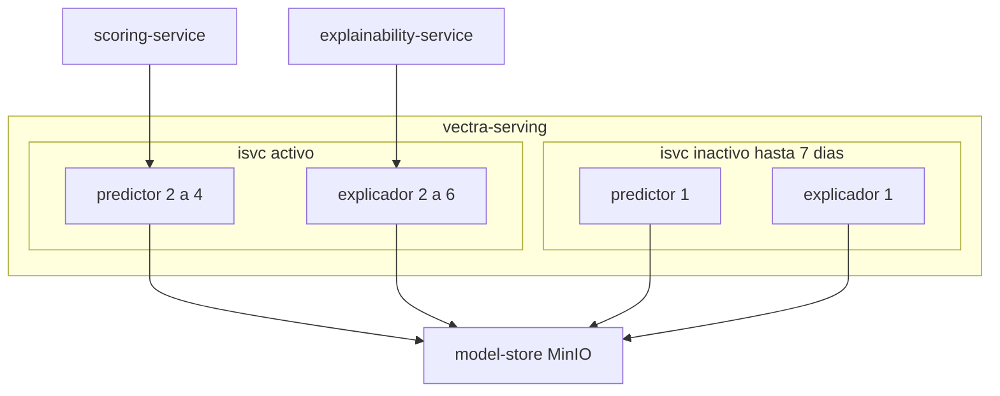

# Arquitectura de despliegue — U6 `model-serving`

Vista de producción (staging con 1 réplica por componente; kind igual que staging).

---

## 1. Topología

### Diagrama



### Alternativa en texto

```text
vectra-serving
  isvc activo   : predictor (2..4, HPA CPU 60 %, por zona, PDB) + explicador (2..6, igual)
  isvc inactivo : predictor 1 + explicador 1 (hasta 7 días, para rollback)
scoring-service -> predictor del isvc activo (F19)
explainability-service -> explicador del isvc activo (F22)
cada componente -> model-store (descarga y verificación del paquete al arrancar, F46)
vectra-staging: isvc de 1 réplica por componente (F30, ensayos RT-3)
```

## 2. Ciclo de una promoción

```text
PR 1 (promoción: agrega isvc nuevo con mínimos de prod) -> revisión -> merge -> sync manual
   -> isvc nuevo listo (paquete verificado)
mark_active (ingeniero, MFA) -> serving-config.inference_service = nuevo -> scoring lo usa en <= 6 s
PR 2 (post-activación: baja el anterior a 1 réplica) -> revisión -> merge -> sync manual
PR 3 (retiro, a los 7 días de inactivo) -> revisión -> merge -> sync manual
Rollback: PR (restaura mínimos del anterior) -> sync -> listo -> mark_active -> PR post-activación
```

## 3. Escenarios de resiliencia (RESILIENCY-14 = C)

| Escenario | Resultado esperado |
|---|---|
| Caída de una zona | El activo sigue con sus réplicas de la otra zona; el HPA repone |
| Paquete alterado en el model-store | El componente nuevo no queda listo (`ModelPackageIntegrityFailed`); el activo sigue sirviendo |
| `mark_active` antes de que el nuevo esté listo | scoring recibe errores del nuevo → fail-closed; `InferenceServiceNotReady` SEV1 (el operador revierte con `mark_active` de la anterior, todavía con 2 réplicas porque el PR 2 aún no se aplicó) |
| Saturación | 503 inmediatos → fail-closed en el llamador; `ServingSaturation` |

Se documentan aquí y se ejecutan en Operations.
