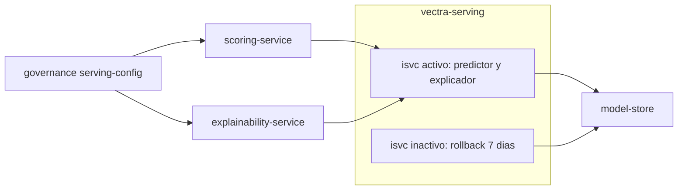

# Componentes lógicos — U6 `model-serving`

---

## 1. Inventario

| Componente | Namespace | Función | Patrón | PriorityClass |
|---|---|---|---|---|
| `InferenceService` `isvc-<8 hex>` (uno por versión) | `vectra-serving` | Agrupa predictor y explicador de una versión | P-U6-02 | — |
| Predictor (imagen de Vectra) | `vectra-serving` | Vector + predicción + `confidence` | P-U6-01, 03, 04, 05 | `vectra-high` |
| Explicador (imagen de Vectra) | `vectra-serving` | TreeSHAP nativo de XGBoost | P-U6-03, 04, 05 | `vectra-high` |
| Storage initializer de KServe | `vectra-serving` | Descarga el paquete del model-store (F46, solo lectura) | NFR-U6-31 | — |
| `InferenceService` de staging | `vectra-staging` | Validación (F30) y ensayos RT-3; 1 réplica por componente | NFR-U6-20..22 | `vectra-low` |
| Plantilla Helm del `InferenceService` | Repositorio GitOps | La usa `promotion-tool` para generar el PR | P-U6-02 | — |

## 2. Dependencias

### Diagrama



### Alternativa en texto

```text
governance (serving-config.inference_service) -> indica a scoring y explainability qué isvc usar
scoring-service -> isvc activo / predictor  (:predict -> score, confidence, model_version_id)   F19
explainability-service -> isvc activo / explicador (:explain -> contribuciones, base_value, model_version_id) F22
cada isvc (activo o inactivo) -> model-store (descarga y verificación del paquete al arrancar) F46
isvc inactivo: vivo 7 días para rollback; después lo retira un PR de promotion-tool
staging: isvc de 1 réplica, solo para model-validation-job (F30) y ensayos RT-3
```

## 3. Pendiente para el Infrastructure Design de U6
- Recursos por componente (producción y staging).
- Confirmar que F19, F22, F30 y F46 cubren los `InferenceService` por etiqueta (sin flujos nuevos).
- Tiempo de arranque esperado y valores de `startupProbe`.
