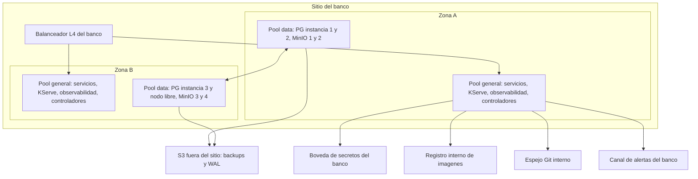

# Arquitectura de despliegue — U1 `platform-foundation`

Vista física de producción (staging es igual). kind reproduce la misma topología con 4
workers y 2 zonas simuladas.

---

## 1. Topología por zonas

### Diagrama



### Alternativa en texto

```text
Sitio del banco
  Zona A
    pool general : servicios (>=1 réplica de cada uno), KServe, observabilidad, controladores HA
    pool data    : PostgreSQL (instancias de cada cluster según el reparto), MinIO x2
  Zona B
    pool general : servicios (>=1 réplica de cada uno), KServe, observabilidad, controladores HA
    pool data    : PostgreSQL (resto de instancias + un nodo libre para reclonar), MinIO x2
  Balanceador L4 -> api-gateway (único Service LoadBalancer)
Salidas del sitio/clúster:
  PostgreSQL -> S3 fuera del sitio (F70: backups + WAL, archive_timeout 60 s)
  restore-drill -> S3 fuera del sitio (F75: solo lectura)
  restore-drill -> Pushgateway (F87, dentro del clúster) <- Prometheus (F88)
  ESO -> bóveda del banco (F74)
  Kyverno -> registro interno (F76: verificación de firmas)
  Argo CD -> espejo Git interno (F71)
  Alertmanager -> canal del banco (F72, incluido Watchdog)
```

El reparto exacto de instancias de PostgreSQL por zona lo decide el scheduler, con
anti-afinidad obligatoria por nodo y reparto preferido por zona. Cada cluster tiene 3
instancias; la zona con 2 instancias varía por cluster.

## 2. Namespaces

| Namespace | Pool | Contenido |
|---|---|---|
| `vectra-edge` | general | api-gateway, console-spa (U2, U10) |
| `vectra-app` | general | Servicios de negocio (U3, U4, U7, U8, U9, U11) |
| `vectra-serving` | general | InferenceServices de producción (U6) |
| `vectra-staging` | general | InferenceServices de staging, model-validation-job (U4, U6) |
| `vectra-data` | data | PostgreSQL ×4 (CloudNativePG), MinIO |
| `vectra-identity` | general | Keycloak (U2) |
| `vectra-mock` | general | core-banking-mock, channel-simulator (U12) |
| `vectra-observability` | general | Prometheus, Alertmanager, Loki, Tempo, OTel Collector, Alloy, Grafana |
| `vectra-restore-drill` | data | CronJob `restore-drill` y cluster efímero |
| `argocd` | general | Argo CD |
| `kserve` | general | Controlador de KServe |
| `cnpg-system`, `cert-manager`, `linkerd`, `linkerd-cni`, `kyverno`, `external-secrets` | general | Controladores de plataforma |

## 3. Orden de instalación (sync waves, P-U1-12)

| Wave | Contenido | Requisito previo verificable |
|---|---|---|
| — | Suite de conformidad del CNI (INF-U1-04) | La suite pasa en el clúster de destino |
| 0 | CRDs y operadores: CloudNativePG, cert-manager, ESO, Kyverno, CRDs de Linkerd, KServe, Argo CD | `kubectl get crd` lista los CRDs esperados |
| 1 | Políticas de Kyverno, plano de control de Linkerd + CNI, PriorityClasses, namespaces, NetworkPolicies y políticas de Linkerd generadas | `kyverno test` y `linkerd check` en verde |
| 2 | Clusters de PostgreSQL, MinIO, Vault (kind) | Clusters en `Cluster in healthy state`; buckets creados con object lock |
| 3 | Keycloak | Realm importado (U2) |
| 4 | Observabilidad | `Watchdog` recibido en el canal |
| 5 | Servicios de Vectra, `restore-drill` | Readiness en verde (P-U1-04) |
| 6 | InferenceServices | `READY=True` |

Cada wave entra por un sync manual aprobado (AUTONOMIA-01). En kind, el runbook ejecuta
la misma secuencia con evidencia (`argocd app diff`) adjunta al PR.

## 4. Escenarios de resiliencia sobre esta topología (RESILIENCY-14 = C)

| Escenario | Cómo se reproduce en kind | Resultado esperado |
|---|---|---|
| Fallo de zona | `kubectl drain` de los 2 workers de `zone-a` | Servicios en `zone-b`; PostgreSQL promueve y reclona en el nodo libre; escrituras bloqueadas mientras se clona (NFR-U1-03); Kyverno y Linkerd siguen admitiendo pods |
| Pérdida del sitio | Clúster kind nuevo + restore desde S3 | Restore ≤ 4 h; `verify_chain` «íntegra» (NFR-U1-07) |
| MinIO degradado (1 de 4 pods) | Borrar un pod de MinIO | Lecturas y escrituras siguen (erasure coding) |
| Keycloak sin JWKS | NetworkPolicy temporal que corta F50 | 503 tras vencer la cache (U0, P-U0-06) |

Se documentan aquí y se ejecutan en Operations.
