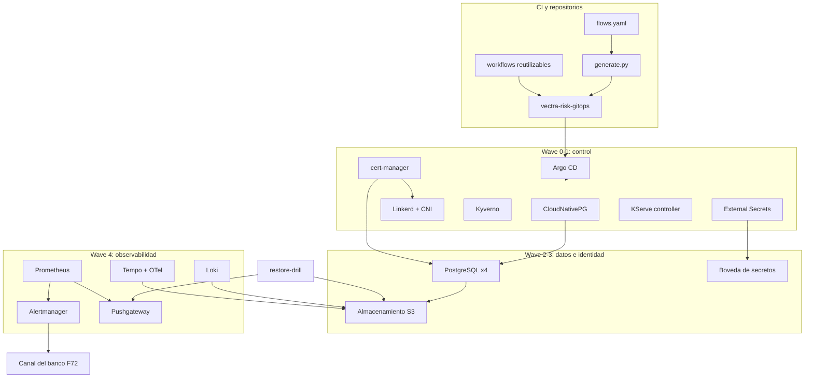

# Componentes lógicos — U1 `platform-foundation`

Componentes de plataforma que U1 entrega como charts y manifiestos en
`vectra-risk-gitops`. La asignación final a namespaces, recursos y flujos la hace el
Infrastructure Design de U1.

---

## 1. Inventario

| Componente | Función | Patrón / NFR | Wave | PriorityClass |
|---|---|---|---|---|
| CloudNativePG (operador) | Ciclo de vida de PostgreSQL, failover, backups | NFR-U1-02, 05 | 0 | `vectra-critical` |
| Clusters PostgreSQL ×4 | `case-db`, `governance-db`, `registry-db`, `keycloak-db` (3 instancias c/u) | NFR-U1-02..06 | 2 | `vectra-critical` |
| MinIO (solo kind) | Almacenamiento S3: backups, WAL, model-store, Loki, Tempo | Q6 | 2 | `vectra-normal` |
| cert-manager | CA interna, certificados del borde, de PostgreSQL y de Linkerd | P-U1-03 | 0 | `vectra-critical` |
| Linkerd (+ linkerd-cni) | mTLS y autorización por identidad | P-U1-02 | 0–1 | `vectra-critical` |
| Kyverno | Admisión y políticas | P-U1-06, 09 | 0–1 | `vectra-critical` |
| External Secrets Operator | Secrets desde la bóveda (Vault en kind) | NFR-U1-24 | 0 | `vectra-high` |
| Vault (solo kind) | Bóveda de desarrollo | NFR-U1-24 | 2 | `vectra-normal` |
| Controlador de KServe | Reconciliar InferenceServices (K05) | INCEPTION | 0 | `vectra-high` |
| Prometheus + reglas | Métricas, SLO, alertas | P-U1-07, 11 | 4 | `vectra-normal` |
| Alertmanager | Enrutamiento por severidad, `Watchdog` por F72 | P-U1-07, 10 | 4 | `vectra-normal` |
| Loki + agente de logs | Logs con object lock, 90 días | NFR-U1-30 | 4 | `vectra-normal` |
| Tempo + OTel Collector | Trazas, 7 días | NFR-U1-31 | 4 | `vectra-normal` |
| Pushgateway | Métricas de jobs batch (`restore-drill`) | P-U1-05 | 4 | `vectra-normal` |
| Grafana | Dashboards como código | NFR-U1-33 | 4 | `vectra-normal` |
| Argo CD | GitOps con sync manual | P-U1-12 | 0 | `vectra-normal` |
| `restore-drill` (CronJob) | Simulacro semanal de restore | P-U1-05 | 5 | `vectra-low` |
| Generador de red (`flows.yaml` + `generate.py`) | NetworkPolicies, Linkerd authz, pruebas de conectividad | P-U1-01, 02 | CI | — |
| Workflows reutilizables de CI | tests, supply-chain, evidence, forbidden-steps, policies | NFR-U1-40..42 | CI | — |
| Runbooks y plantillas | Runbook por alerta, COE | P-U1-10 | Repo | — |

## 2. Dependencias

### Diagrama



### Alternativa en texto

```text
CI:   flows.yaml -> generate.py -> NetworkPolicies + Linkerd authz + pruebas -> vectra-risk-gitops
      workflows reutilizables -> evidencia en el PR (sin tocar el clúster)
GitOps: vectra-risk-gitops -> Argo CD (sync manual, waves 0..6)
Wave 0-1: CloudNativePG, cert-manager, Linkerd (+CNI), Kyverno, ESO, KServe controller
Wave 2-3: PostgreSQL x4 -> S3 (backups + WAL, archive_timeout 60 s)
          cert-manager -> certificados de Linkerd, borde y PostgreSQL
          ESO -> bóveda (Vault en kind; bóveda del banco en prod)
Wave 4:   Loki, Tempo -> S3 ; Prometheus -> Alertmanager -> canal del banco (F72, Watchdog)
Wave 5:   restore-drill -> lee S3, crea cluster efímero, verify_chain, empuja métricas al Pushgateway (F87); Prometheus lo lee (F88)
```

## 3. Métricas y alertas que introduce U1

| Alerta | Severidad | Patrón |
|---|---|---|
| `WalArchiveStale` (> 5 min) | SEV1 | NFR-U1-05 |
| `BackupFailed` | SEV1 | NFR-U1-05 |
| `RestoreDrillFailed` / `RestoreDrillMissing` | SEV1 | P-U1-05 |
| `RegistryDbWritesBlocked` (sin réplica síncrona) | SEV1 | NFR-U1-03 |
| `KyvernoUnavailable` / `LinkerdControlPlaneDown` | SEV1 | P-U1-06 |
| `SingleZoneOperation` | SEV2 | NFR-U1-32 |
| `PostgresReplicaLag` | SEV2 | NFR-U1-32 |
| `CertificateExpiringSoon` | SEV2 / SEV1 | P-U1-03 |
| `RecommendationSLOBurnFast` / `Slow` | SEV2 / SEV3 | P-U1-11 |
| `FailClosedPersistente` | SEV2 | P-U1-11 |
| `AuthDeniedBurst` | SEV2 | SECURITY-14 |
| `PostgresConnectionsHigh` (> 80 %) | SEV3 | P-U1-08 |
| `HPAMaxedOut` | SEV3 | NFR-U1-32 |
| `Watchdog` | latido | P-U1-07 |

## 4. Pendiente para Infrastructure Design de U1

- Namespaces y bindings K0x de cert-manager, Linkerd, Kyverno y ESO.
- Destino del almacenamiento S3 en producción (in-cluster o del banco) y, si es externo, los flujos de egress de Loki, Tempo y el model-store.
- Egress de ESO hacia la bóveda del banco.
- `max_connections` por cluster según los máximos de HPA (P-U1-08).
- CNI de kind (Calico propuesto) y agente de logs (Alloy o Promtail).
