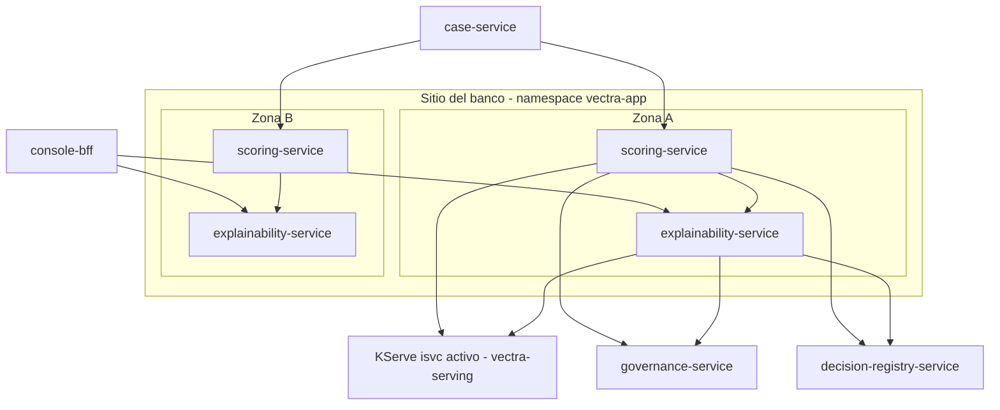

# Arquitectura de despliegue — U7 `scoring-explainability`

Vista de producción. Staging y kind son iguales, con 2 réplicas fijas en kind.

---

## 1. Topología

### Diagrama



### Alternativa en texto

```text
Sitio del banco, namespace vectra-app (pool general)
  Zona A / Zona B:
    scoring-service        2..6 (HPA CPU 70 %), PDB minAvailable 1, vectra-high
    explainability-service 2..6 (HPA CPU 70 %), PDB minAvailable 1, vectra-high
  Entradas:  case-service -> scoring (F15); console-bff -> explainability (F12); scoring -> explainability (F20)
  Salidas de scoring:         governance (F18), KServe :predict (F19), registro (F21)
  Salidas de explainability:  KServe :explain (F22), registro (F23), governance (F103)
  Cada pod: sidecar nativo de Linkerd (mTLS); sin volúmenes; sin egress
  Por legibilidad el diagrama muestra las conexiones de la zona A; la zona B es simétrica
  y Linkerd balancea entre zonas.
```

## 2. Ciclo de vida de un pod

```text
arranque  -> proceso listo -> readiness OK (8081) -> recibe tráfico
             (en segundo plano: precarga del diccionario de la versión activa, NFR-U7-21)
terminar  -> preStop sleep 5 s (sale de los endpoints)
          -> SIGTERM: uvicorn deja de aceptar y espera las solicitudes en curso (<= 10 s)
          -> el proxy de Linkerd termina después del contenedor
          -> terminationGracePeriodSeconds 20 s (peor caso de una solicitud: ~6,1 s)
```

## 3. Inventario de recursos de Kubernetes (por servicio)

| Recurso | Notas |
|---|---|
| `Deployment` | INF-U7-01, 03; las variables de entorno solo traen URLs, audiencias y telemetría (INF-U7-04) |
| `Service` | 8080 (API) y 8081 (métricas y probes) |
| `HorizontalPodAutoscaler` | 2–6, CPU 70 % |
| `PodDisruptionBudget` | `minAvailable: 1` |
| `ServiceAccount` | Identidad de la malla (Linkerd) |
| `ExternalSecret` | Llave privada del cliente de Keycloak (`private_key_jwt`; U2 domain-entities §2.2), entregada por ESO desde la bóveda |
| `ServiceMonitor` | Puerto 8081 |
| `PrometheusRule` | Alertas de P-U7-08, con `runbook_url` |
| `Application` de Argo CD | Sync manual (AUTONOMIA-01) |

`NetworkPolicy` y `AuthorizationPolicy` vienen de U1 y U2 (sin flujos nuevos, INF-U7-05).
