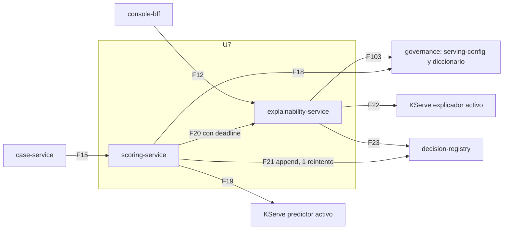

# Componentes lógicos — U7 `scoring-explainability`

---

## 1. Inventario

| Componente | Servicio | Función | Patrón | PriorityClass |
|---|---|---|---|---|
| `scoring-service` (`Deployment`, 2–6) | `vectra-app` | Orquesta la recomendación (BR-U0-08) | P-U7-01, 02, 04, 05, 06 | `vectra-high` |
| `explainability-service` (`Deployment`, 2–6) | `vectra-app` | Explicación, narrativa, factualidad y resumen al solicitante | P-U7-01, 04, 05, 06 | `vectra-high` |
| `orchestrator` | scoring | Secuencia de U0 + presupuesto previo al registro + append con reintento | P-U7-01, 02, 03 | — |
| `serving_config_client` | scoring y explainability | Caché ≤ 5 s con `etag` | P-U7-05 | — |
| Clientes por dependencia (`httpx` + `deps.call`) | ambos | Un pool y un circuit breaker por dependencia | P-U7-04 | — |
| `explain` (TaskGroup diccionario ∥ `:explain`) | explainability | Llamadas en paralelo dentro del presupuesto | P-U7-01 | — |
| `dictionary_cache` | explainability | LRU de 4 versiones, sin expiración | P-U7-05 | — |
| `policy`, `narrative`, `factuality`, `applicant` | — | Funciones puras (FD) | — | — |
| `metrics` | ambos | Métricas de P-U7-08 en el puerto 8081 | P-U7-08 | — |
| Reglas de alerta y runbooks | Repositorio GitOps | P-U7-08 | P-U7-08 | — |

Namespace `vectra-app`, el de los servicios de negocio en U1 (deployment-architecture).

## 2. Dependencias

### Diagrama



### Alternativa en texto

```text
case-service -> scoring-service           POST /v1/recommendations                          F15
scoring -> governance                     GET /v1/serving-config (cache <= 5 s)              F18  pool 5
scoring -> KServe predictor activo        :predict                                           F19  pool 20
scoring -> explainability                 POST /v1/explanations + x-vectra-deadline          F20  pool 20
   explainability -> KServe explicador    :explain              } en paralelo              F22  pool 20
   explainability -> governance           diccionario (si falta) }                          F103 pool 5
scoring -> decision-registry              append recommendation (2 intentos) o fail_closed  F21  pool 10
console-bff -> explainability             POST /v1/applicant-summaries
                                          (case_id + recommendation_entry_id)               F12
   explainability -> decision-registry    proyección explanation de esa entrada             F23  pool 5
Presupuesto de scoring antes del registro: 700 ms desde la llegada.
Cada pool tiene su propio circuit breaker (vectra_common.deps).
```

### Presupuesto de la ruta crítica (p95, caché caliente)

| Tramo | p95 |
|---|---|
| `serving-config` (caché) | ~0 ms |
| `:predict` (U6) | 30 ms |
| explainability (incluye `:explain` de 150 ms) | ≤ 250 ms |
| append (U3) | 50 ms |
| Proceso y red | ~50 ms |
| **Total** | **≈ 380 ms ≤ 400 ms (NFR-U7-01)** |

## 3. Pendiente para el Infrastructure Design de U7
- Recursos (requests y limits) por servicio y su relación con el HPA al 70 %.
- Confirmar que F12, F15, F18–F23 y F103 ya existen en las `NetworkPolicy` y `AuthorizationPolicy` de U1 y U2 (sin flujos nuevos).
- Ubicación de las plantillas en la imagen y empaquetado de las reglas de alerta.
