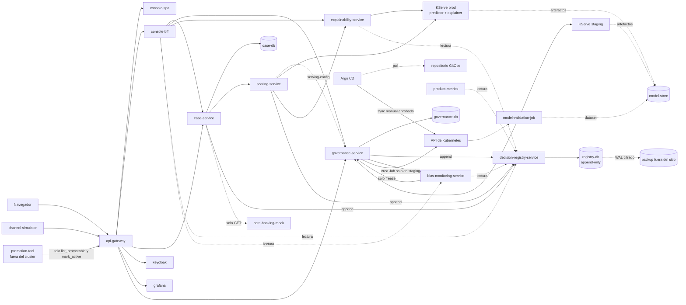

# Dependencias entre componentes — Vectra Risk

## 0. Propósito y regla de completitud

Este documento es la **fuente de verdad** de la que Infrastructure Design deriva:
1. las **NetworkPolicies** (ingress y egress por pod);
2. el **RBAC de Kubernetes** (acceso a la API del clúster);
3. los **roles de base de datos**;
4. los **scopes de identidad de servicio** en Keycloak.

**Regla de completitud:** el inventario es **cerrado**. Todo flujo de red, acceso a la
API de Kubernetes o acceso a una base de datos que no aparezca en §2–§5 está
**denegado**, y la infraestructura no debe permitirlo. Agregar un flujo exige cambiar
este documento.

Los puertos son **valores por defecto de diseño**. Infrastructure Design puede cambiar
un número de puerto, pero no la existencia ni la dirección de un flujo.

| Puerto | Uso |
|---|---|
| `8080/TCP` | API de aplicación de los servicios FastAPI y de los mocks (TLS o mTLS según NFR Design) |
| `8081/TCP` | `/metrics` y health checks de cada servicio (separado de la API) |
| `5432/TCP` | PostgreSQL |
| `8443/TCP` | Keycloak (OIDC) |
| `4317/TCP` | OTLP gRPC hacia el OpenTelemetry Collector |
| `3100/TCP` | Loki (push de logs) |
| `9091/TCP` | Pushgateway (métricas de jobs batch) |
| `6379/TCP`, `26379/TCP` | Valkey y Sentinel (contadores del rate limit, U2) |
| `8083/TCP` | gRPC del servicio de rate limit (U2; no usa 8081, reservado para health y métricas) |
| `18000/TCP` | xDS del controlador de Envoy Gateway hacia Envoy |
| `8200/TCP` | Vault (Transit y secretos), solo en kind |
| `9000/TCP` | MinIO in-cluster (API S3): model-store, Loki, Tempo; también el puerto de gestión (health y métricas) de Keycloak, que no se expone en el gateway |
| `80/TCP` | predictor y explainer de KServe (modo RawDeployment) |
| `443/TCP` | salidas del clúster listadas en §5 y la API de Kubernetes |

## 1. Namespaces (zonas de red)

| Namespace | Contenido |
|---|---|
| `vectra-edge` | api-gateway (data plane de Envoy), servicio de rate limit, Valkey + Sentinel, console-spa (estáticos) |
| `vectra-app` | console-bff, case-service, scoring-service, explainability-service, governance-service, bias-monitoring-service, decision-registry-service, product-metrics |
| `vectra-serving` | InferenceServices de producción (predictor + explainer) |
| `vectra-staging` | InferenceServices de staging, model-validation-job |
| `vectra-data` | PostgreSQL (`case-db`, `governance-db`, `registry-db`, `keycloak-db`) con CloudNativePG; MinIO (model-store, Loki, Tempo) |
| `vectra-restore-drill` | CronJob `restore-drill` y cluster efímero de PostgreSQL (U1, P-U1-05) |
| `vectra-identity` | Keycloak, `keycloak-config-cli` (hook de sync), `realm-drift` (CronJob), exportador de antigüedad de llaves |
| `vectra-mock` | core-banking-mock, channel-simulator |
| `vectra-observability` | Prometheus, Alertmanager, Grafana, Loki, Tempo, OpenTelemetry Collector, agente de logs |
| `argocd` | Argo CD |
| `kserve` | controlador de KServe |
| `cnpg-system`, `cert-manager`, `linkerd`, `linkerd-cni`, `kyverno`, `external-secrets` | Controladores de plataforma (U1 Infrastructure Design, INF-U1-06). En kind también `vault` |
| `envoy-gateway-system` | Controlador de Envoy Gateway (U2 Infrastructure Design, INF-U2-02) |

Los nombres son de diseño. Infrastructure Design puede fusionar namespaces solo si
conserva las mismas reglas de flujo.

---

## 2. Flujos de red permitidos (inventario cerrado)

Tipo: **S** = llamada síncrona request/response · **R** = lectura · **A** = append
(escritura restringida al registro) · **W** = escritura propia · **O** = observabilidad.

### 2.1 Entrada al clúster y borde

| ID | Origen | Destino | Puerto | Tipo | Propósito | Controles |
|---|---|---|---|---|---|---|
| F01 | Navegador (red del banco) | api-gateway | 443 | S | Única entrada a Vectra Risk | TLS, rate limit, límite de payload, access log |
| F02 | api-gateway | console-spa (estáticos) | 8080 | R | Servir la SPA | Cabeceras SECURITY-04 |
| F03 | api-gateway | console-bff | 8080 | S | `/api/console/**` | JWT validado en el gateway |
| F04 | api-gateway | case-service | 8080 | S | `/api/intake/**` (solo ingesta) | JWT de cliente `channel`; ruta limitada a `POST /v1/intake/applications` |
| F05 | api-gateway | Keycloak | 8443 | S | `/auth/**`: login OIDC del navegador | Solo endpoints públicos del realm; consola admin **no** expuesta |
| F06 | api-gateway | Grafana | 3000 | S | `/grafana/**`: dashboards embebidos en la SPA | Grafana con login OIDC contra Keycloak y roles por equipo |
| F07 | channel-simulator | api-gateway | 443 | S | Solicitudes sintéticas y adversariales | Mismo camino que un canal real (F04) |
| F08 | promotion-tool (humano, fuera del clúster) | api-gateway → governance-service | 443 → 8080 | R/W | **Solo** `GET /v1/models?state=aprobado` y `POST /v1/models/{id}/activation` (ruta `/api/promotion/**`) | Token del usuario `ingeniero_riesgo` con MFA + scope `governance:promotion`; ninguna otra ruta de governance expuesta por el gateway |
| F09 | Prometheus del banco (opcional, **deshabilitado por defecto**) | api-gateway → Prometheus `/federate` | 443 → 9090 | R | Métricas agregadas que el banco **lee** (INF-U1-08) | Usuario de solo lectura; sin PII en las métricas; Vectra no hace remote-write |

### 2.2 Aplicación (`vectra-app` ↔ `vectra-app` / `vectra-serving`)

| ID | Origen | Destino | Puerto | Tipo | Propósito | Controles |
|---|---|---|---|---|---|---|
| F10 | console-bff | case-service | 8080 | S | Bandeja, detalle, alta manual, decisión, consultas de explicación, fallos persistentes | Token del usuario propagado |
| F11 | console-bff | governance-service | 8080 | S/W | Modelos, políticas, fuentes, aprobaciones, resolución de congelados | Token del usuario; MFA verificado por claim |
| F12 | console-bff | explainability-service | 8080 | S | Solo `POST /v1/applicant-summaries` | Rol cro o analista |
| F13 | console-bff | decision-registry-service | 8080 | R | Expediente, verificación de integridad | Rol cro o cumplimiento |
| F14 | console-bff | bias-monitoring-service | 8080 | R | Dashboard de disparidad, paquetes de congelamiento | Rol cumplimiento o cro |
| F15 | case-service | scoring-service | 8080 | S | `POST /v1/recommendations` | Identidad de servicio `case-service` |
| F16 | case-service | decision-registry-service | 8080 | A | Decisión humana, consulta de explicación, fail-closed | Scope `registry:append:case` |
| F17 | case-service | core-banking-mock | 8080 | R | **Solo** `GET /v1/credits/{id}` | NetworkPolicy + scope `core:read-credit` (solo case-service); la escritura exige `core:write-credit`, que nadie tiene (AUTONOMIA-03) |
| F18 | scoring-service | governance-service | 8080 | R | `GET /v1/serving-config` | Scope `governance:read-serving` |
| F19 | scoring-service | KServe predictor (`vectra-serving`) | 80 | S | `:predict` | La NetworkPolicy admite cualquier predictor del namespace (etiqueta `vectra.io/component=predictor`); scoring solo llama al `InferenceService` que indica `serving-config.inference_service` (azul/verde, U6) |
| F20 | scoring-service | explainability-service | 8080 | S | `POST /v1/explanations` | Identidad de servicio `scoring-service` |
| F21 | scoring-service | decision-registry-service | 8080 | A | Recomendación y fail-closed | Scope `registry:append:scoring` |
| F22 | explainability-service | KServe explainer (`vectra-serving`) | 80 | S | `:explain` | Mismo `InferenceService` que el predictor (`serving-config.inference_service`); etiqueta `vectra.io/component=explainer` |
| F23 | explainability-service | decision-registry-service | 8080 | R | Leer la explicación registrada para el resumen al solicitante | Scope `registry:read:explanation` |
| F24 | governance-service | decision-registry-service | 8080 | A | Eventos de modelo, política, fuente, congelamiento y resolución | Scope `registry:append:governance` |
| F25 | governance-service | bias-monitoring-service | 8080 | S | `compare_source` (antes/después) | Scope `bias:compare` |
| F26 | bias-monitoring-service | decision-registry-service | 8080 | R | Recomendaciones y decisiones con etiquetas de monitoreo | Scope `registry:read:monitoring` |
| F27 | bias-monitoring-service | governance-service | 8080 | W | **Solo** `POST /v1/models/{id}/freeze` | Scope `governance:freeze` (AUTONOMIA-04) |
| F28 | product-metrics | decision-registry-service | 8080 | R | Agregados para métricas de negocio | Scope `registry:read:metrics` |

### 2.3 Staging

| ID | Origen | Destino | Puerto | Tipo | Propósito | Controles |
|---|---|---|---|---|---|---|
| F30 | model-validation-job | KServe de staging (`vectra-staging`) | 80 | S | `:predict` y `:explain` para AUC y sincronía | Sin acceso a `vectra-serving` |
| F31 | model-validation-job | model-store | 9000 | R | Dataset de validación | Credencial de solo lectura, bucket de validación |
| F32 | model-validation-job | governance-service | 8080 | W | `PUT /v1/models/{id}/validation-report` | Scope `governance:validation-report` |

### 2.4 Datos (`vectra-data`)

| ID | Origen | Destino | Puerto | Tipo | Propósito |
|---|---|---|---|---|---|
| F40 | case-service | PostgreSQL `case-db` | 5432 | W | Solicitudes, casos, cola de trabajos |
| F41 | governance-service | PostgreSQL `governance-db` | 5432 | W | Versiones, políticas, fuentes, aprobaciones |
| F42 | decision-registry-service | PostgreSQL `registry-db` | 5432 | A | Registro encadenado |
| F43 | Keycloak | PostgreSQL `keycloak-db` | 5432 | W | Realm y usuarios |
| F44 | Jobs de migración (uno por servicio, hook de sync de Argo CD) | Su propia base (`case-db` / `governance-db` / `registry-db`) | 5432 | DDL | Migraciones de esquema aprobadas |
| F45 | PostgreSQL primario | PostgreSQL réplica (otra zona) | 5432 | Replicación | Réplica síncrona (RPO 0 ante fallo de zona) |
| F46 | Pods de KServe (storage initializer), prod y staging | model-store | 9000 | R | Descarga de artefactos de la versión |
| F47 | governance-service | model-store | 9000 | R | Verificar el checksum de artefactos registrados |
| F96 | decision-registry-service | `registry-db-ro` (réplica) | 5432 | R | Proyecciones (pool `projections`, INF-U3-04) |
| F97 | `registry-checkpoint` → `registry-db-rw`; `registry-verify-*` y `registry-archive` → `registry-db-ro` | `registry-db` | 5432 | A / R | Checkpoint; verificación y archivo (U3) |
| F101 | `model-archive` (U4) | MinIO, bucket `model-store` | 9000 | R | Leer artefactos y explicadores para archivarlos |
| F102 | `model-archive` (U4) | `governance-db` | 5432 | W | Registrar `archived_uri`/`archived_at` (rol `gov_archiver`, permiso por columna) |

### 2.5 Identidad

| ID | Origen | Destino | Puerto | Tipo | Propósito |
|---|---|---|---|---|---|
| F50 | api-gateway, console-bff, case, scoring, explainability, governance, bias, registry, product-metrics, model-validation-job, Grafana | Keycloak | 8443 | R | JWKS y validación de tokens; client credentials de las identidades de servicio |

### 2.6 Observabilidad (`vectra-observability`)

| ID | Origen | Destino | Puerto | Tipo | Propósito |
|---|---|---|---|---|---|
| F60 | Prometheus | Todos los pods de `vectra-app`, `vectra-edge`, `vectra-serving`, `vectra-mock`, Keycloak, PostgreSQL (exporter), Argo CD | 8081 (o puerto de métricas del componente) | O | Scrape de métricas |
| F61 | Todos los pods de aplicación | OpenTelemetry Collector | 4317 | O | Trazas (y logs si se usa OTLP) |
| F62 | OpenTelemetry Collector | Tempo / Loki | 4317 / 3100 | O | Almacenamiento de trazas y logs |
| F63 | Agente de logs: Grafana Alloy (DaemonSet) | Loki | 3100 | O | Logs de stdout de los contenedores |
| F64 | Prometheus | Alertmanager | 9093 | O | Envío de alertas |
| F65 | Grafana | Prometheus, Loki, Tempo | 9090 / 3100 / 3200 | R | Fuentes de datos de dashboards |
| F66 | Loki | MinIO (`vectra-data`) | 9000 | W | Chunks e índices; bucket con object lock de 90 días |
| F67 | Tempo | MinIO (`vectra-data`) | 9000 | W | Bloques de trazas; lifecycle de 7 días |

Ningún componente de observabilidad exporta fuera del clúster, salvo la notificación F72.

### 2.7 Plataforma (agregado en U1 Infrastructure Design)

| ID | Origen | Destino | Puerto | Tipo | Propósito |
|---|---|---|---|---|---|
| F80 | Operador CloudNativePG (`cnpg-system`) | Instancias de PostgreSQL (`vectra-data` y el cluster efímero de `vectra-restore-drill`) | 8000 / 5432 | O | Estado de instancias, failover, configuración |
| F81 | API server de Kubernetes | Webhook de CloudNativePG | 9443 | O | Validación y defaulting de los CRDs |
| F82 | API server de Kubernetes | Webhook de cert-manager | 10250 | O | Validación de `Certificate` / `Issuer` |
| F83 | Proxies de Linkerd (todos los pods mallados) | Plano de control de Linkerd (`destination`, `identity`) | 8086 / 8080 / 8090 | O | Descubrimiento, políticas y emisión de certificados mTLS |
| F84 | API server de Kubernetes | Proxy-injector de Linkerd | 8443 | O | Inyección del proxy en la admisión |
| F85 | API server de Kubernetes | Admission controller de Kyverno | 9443 | O | Validación y mutación en la admisión (`failurePolicy: Fail`) |
| F86 | ESO (`external-secrets`) | Vault (`vault`, **solo kind**) | 8200 | R | Lectura de secretos de desarrollo |
| F98 | `registry-checkpoint`, `registry-archive` | Vault (`vault`, **solo kind**) | 8200 | S | Firma Transit de checkpoints y manifiestos (U3) |
| F87 | `restore-drill` (`vectra-restore-drill`) | Pushgateway (`vectra-observability`) | 9091 | O | Push de `vectra_restore_drill_success`, duración y LSN alcanzado (P-U1-05) |
| F88 | Prometheus | Pushgateway | 9091 | O | Scrape de las métricas empujadas por jobs batch (`honor_labels: true`) |

### 2.8 Borde e identidad internos (agregado en U2 Infrastructure Design)

| ID | Origen | Destino | Puerto | Tipo | Propósito |
|---|---|---|---|---|---|
| F90 | Envoy (data plane) | Servicio de rate limit | 8083 | S | Decisiones de rate limit global (P-U2-01, 06) |
| F91 | Servicio de rate limit | Valkey (vía Sentinel) | 26379 / 6379 | W | Contadores efímeros con TTL |
| F92 | Valkey réplica | Valkey primaria | 6379 | Replicación | Réplica en otra zona |
| F93 | Sentinel | Valkey y otros Sentinel | 6379 / 26379 | O | Monitoreo y failover |
| F94 | `keycloak-config-cli`, `realm-drift` | Keycloak (API de administración, interna) | 8443 | W / R | Aplicar el realm en el sync manual; exportarlo para detectar deriva (BR-U2-12) |
| F95 | Controlador de Envoy Gateway (`envoy-gateway-system`) | Envoy (data plane) | 18000 | O | Configuración xDS |

---

## 3. Acceso a la API de Kubernetes (base del RBAC)

Todo ServiceAccount no listado tiene `automountServiceAccountToken: false` y **ningún**
Role ni RoleBinding.

| ID | ServiceAccount | Namespace del recurso | Verbos y recursos | Motivo |
|---|---|---|---|---|
| K01 | `governance-service` | `vectra-staging` | `create`, `get`, `list`, `watch` sobre `batch/jobs`; `get` sobre `pods/log` | Lanzar y seguir el `model-validation-job` (flujo S3). **Única** escritura a la API de Kubernetes desde un servicio de negocio. No puede crear Jobs en otros namespaces ni tocar InferenceServices |
| K02 | `prometheus` | todos los de Vectra | `get`, `list`, `watch` sobre `pods`, `services`, `endpoints` | Service discovery |
| K03 | `otel-collector` | todos los de Vectra | `get`, `list`, `watch` sobre `pods`, `namespaces` | Enriquecer telemetría con metadata de K8s |
| K04 | `argocd-application-controller` | namespaces de Vectra | Escritura sobre los recursos que gestionan las Applications | Aplicar cambios **solo** tras un sync manual aprobado (AUTONOMIA-01) |
| K05 | `kserve-controller-manager` | `vectra-serving`, `vectra-staging` | Los que requiere el controlador de KServe | Reconciliar InferenceServices |
| K06 | Operador **CloudNativePG** (`cnpg-system`) | `vectra-data`, `vectra-restore-drill` | Los que requiere el operador | Réplicas, failover, backups, cluster efímero del simulacro |
| K07 | `cert-manager` | namespaces de Vectra y `linkerd` | `get`, `list`, `watch`, `create`, `update` sobre `secrets` de certificados; CRDs propios | Emitir y rotar certificados (P-U1-03) |
| K08 | Plano de control de Linkerd | todo el clúster | `get`, `list`, `watch` sobre `pods`, `services`, `endpoints`, CRDs de política; `create` de `tokenreviews` | Descubrimiento, identidad y políticas |
| K09 | `linkerd-cni` | nodos | `get`, `list`, `watch` sobre `pods`, `nodes` | Configurar iptables sin `NET_ADMIN` en los pods |
| K10 | Kyverno | todo el clúster | Lectura de recursos admitidos; escritura solo de sus `PolicyReport` | Admisión y reportes |
| K11 | External Secrets Operator | namespaces de Vectra que declaran `ExternalSecret` | `create`, `update`, `get` sobre `secrets` | Materializar secretos desde la bóveda |
| K12 | `restore-drill` | `vectra-restore-drill` | `create`, `get`, `delete` sobre `clusters.postgresql.cnpg.io`; `get` sobre `pods/log` | Crear y destruir el cluster efímero del simulacro |
| K13 | Grafana Alloy | todo el clúster | `get`, `list`, `watch` sobre `pods`, `namespaces`, `nodes` | Descubrir contenedores y leer sus logs del nodo |
| K14 | Controlador de Envoy Gateway | `vectra-edge` y `envoy-gateway-system` | Lectura de recursos de Gateway API y de Envoy Gateway; gestión de los Deployments, Services y ConfigMaps del data plane | Reconciliar el gateway (INF-U2-02) |

**Explícitamente sin acceso a la API de Kubernetes:** scoring-service,
explainability-service, bias-monitoring-service, case-service,
decision-registry-service, console-bff, product-metrics, channel-simulator,
core-banking-mock, model-validation-job. En particular, **ninguno** puede
modificar InferenceServices, escalar Deployments ni leer Secrets de otros
componentes (AUTONOMIA-03, AUTONOMIA-04, Q7=A).

---

## 4. Roles de base de datos

| Base | Rol | Privilegios | Usado por |
|---|---|---|---|
| `case-db` | `case_app` | `SELECT`, `INSERT`, `UPDATE` en tablas de casos y cola; sin DDL | case-service |
| `case-db` | `case_migrator` | DDL | Job de migración (F44) |
| `governance-db` | `gov_app` | `SELECT`, `INSERT`, `UPDATE` en tablas de gobierno; sin DDL | governance-service |
| `governance-db` | `gov_archiver` | `SELECT` sobre `model_versions` y `model_transitions`; `UPDATE (archived_uri, archived_at)` | CronJob `model-archive` (F102, INF-U4-03) |
| `governance-db` | `gov_migrator` | DDL | Job de migración |
| `registry-db` | `registry_app` | **Solo** `INSERT` y `SELECT`; `UPDATE`/`DELETE`/`TRUNCATE` **revocados** | decision-registry-service |
| `registry-db` | `registry_migrator` | DDL; no se usa en runtime | Job de migración |
| `keycloak-db` | `keycloak` | Propietario de su esquema | Keycloak |
| todas | `backup` | Replicación y archivado de WAL | Operador de PostgreSQL (F45, F70) |

Ningún servicio tiene credenciales de una base que no sea la suya. bias-monitoring y
product-metrics **no** tienen rol de base de datos: leen por API (F26, F28).

---

## 5. Salidas del clúster (egress) — inventario cerrado

| ID | Origen | Destino | Puerto | Contenido | Justificación |
|---|---|---|---|---|---|
| F70 | Operador de PostgreSQL (backup) | Almacenamiento de backup del banco **fuera del sitio** | 443 | Backups base y WAL **cifrados** | R1/R2, NFR-RES-12. Contiene PII cifrada; destino dentro de la infraestructura del banco (Principio 2) |
| F71 | Argo CD (repo-server) | Servidor Git del repositorio GitOps | 443 | Pull de manifiestos, sin datos de solicitantes | GitOps (Q19). **GitHub en kind; espejo Git interno del banco en staging y prod** (INF-U1, Q11) |
| F72 | Alertmanager | Canal de notificación del banco (relay SMTP o chat interno) | 443/587 | Nombre de la alerta, severidad, `runbook_url`, IDs técnicos. **Sin PII** | R9, RESILIENCY-15 |
| F73 | Keycloak (solo en producción real) | IdP/LDAP corporativo del banco | 636/443 | Federación de identidad | En el MVP Keycloak es el IdP simulado y este flujo no existe |
| F74 | External Secrets Operator (staging y prod) | Bóveda de secretos del banco | 443 | Lectura de secretos; **sin datos de solicitantes** | NFR-U1-24 (Q9 de NFR Requirements de U1) |
| F75 | Cluster efímero de `restore-drill` | Almacenamiento de backup del banco fuera del sitio | 443 | **Solo lectura** de backups y WAL cifrados, y de los checkpoints de `vectra-registry-checkpoints` para verificar la cadena restaurada (U3) | P-U1-05; credencial distinta de la de escritura de F70 |
| F76 | Kyverno | Registro interno de imágenes del banco | 443 | Firmas y attestations de Cosign | INF-U1-09; sin datos de solicitantes |
| F77 | `registry-checkpoint` | S3 del banco fuera del sitio, bucket `vectra-registry-checkpoints` (WORM COMPLIANCE) | 443 | Checkpoints firmados; sin datos de solicitantes | INF-U3-01 |
| F78 | `registry-archive` | S3 del banco fuera del sitio, bucket `vectra-registry-archive` (WORM COMPLIANCE, 10 años) | 443 | Segmentos de la cadena: **datos seudonimizados, cifrados** | NFR-U3-04, INF-U3-01; precedente de F70 |
| F79 | `registry-verify-*` | S3 del banco fuera del sitio, bucket `vectra-registry-checkpoints` | 443 | Solo lectura de checkpoints | INF-U3-01 |
| F99 | `registry-checkpoint`, `registry-archive` (staging y prod) | Bóveda del banco (API Transit) | 443 | Solo el digest a firmar | NFR-U3-41, INF-U3-02 |
| F100 | `model-archive` (U4) | S3 del banco fuera del sitio, bucket `vectra-model-archive` (WORM COMPLIANCE, 10 años) | 443 | Artefactos de modelo y explicadores; sin datos de solicitantes | NFR-U4-31, INF-U4-02 |

**Sin egress:** scoring-service, explainability-service, bias-monitoring-service
(AUTONOMIA-05), además de case-service, decision-registry-service, governance-service,
console-bff, product-metrics y los componentes de observabilidad distintos de F72. La
descarga de imágenes de contenedores la hace el kubelet desde el registro aprobado
(SECURITY-10); no es un flujo de pod.

---

## 6. Flujos prohibidos (se verifican con pruebas negativas)

| ID | Flujo prohibido | Regla | Prueba (en el plan de tareas) |
|---|---|---|---|
| X01 | Cualquier pod → `core-banking-mock` con método distinto de `GET`, y cualquier pod distinto de case-service → core-banking-mock | AUTONOMIA-03 | RT-5 (US-603) |
| X02 | scoring, explainability o bias → cualquier destino fuera del clúster | AUTONOMIA-05 | `curl` a un dominio externo desde cada pod (US-604) |
| X03 | Cualquier identidad distinta del rol de usuario `cumplimiento` → transición que saque un modelo de `congelado` | AUTONOMIA-04 | US-305 |
| X04 | bias-monitoring → cualquier endpoint de governance distinto de `freeze` | AUTONOMIA-04, SECURITY-06 | Prueba de scope |
| X05 | Cualquier servicio → base de datos ajena | SECURITY-06 | Conexión denegada por NetworkPolicy y por credenciales |
| X06 | `registry_app` → `UPDATE`/`DELETE`/`TRUNCATE` | Q15, SECURITY-14 | US-401 |
| X07 | Cualquier servicio de negocio → API de Kubernetes, salvo K01 | AUTONOMIA-01, -04 | `kubectl auth can-i --as=system:serviceaccount:...` |
| X08 | `vectra-staging` → `vectra-serving`, y la dirección inversa | Aislamiento staging/producción | Prueba de conectividad |
| X09 | Navegador → cualquier servicio que no sea el api-gateway | SECURITY-07 | Sin Services de tipo LoadBalancer/NodePort salvo el gateway |
| X10 | Keycloak admin console expuesto por el gateway | SECURITY-09 | Prueba de ruta `/auth/admin` → 404 |

---

## 7. Diagrama de flujo de datos (vista lógica)

El diagrama muestra la vista lógica de §2. Por legibilidad omite la observabilidad (F60–F67), la identidad (F50) y la plataforma, el borde interno y los Jobs del registro y de governance (F80–F98, F101, F102).



### Alternativa en texto
```
Borde:        Navegador/simulador -> api-gateway -> {console-spa, console-bff, case-service(intake),
              keycloak(/auth), grafana(/grafana)}
              promotion-tool (humano) -> api-gateway -> governance (solo list_promotable, mark_active)
Originación:  case-service -> scoring-service -> {governance(serving-config), KServe prod predictor,
              explainability-service -> KServe prod explainer} -> decision-registry(append)
Decisión:     console-bff -> case-service -> decision-registry(append)
Gobierno:     console-bff -> governance-service -> {governance-db, decision-registry(append),
              bias(compare_source), API K8s (crear Job en vectra-staging)}
Validación:   model-validation-job -> {KServe staging, model-store(dataset), governance(informe)}
Vigilancia:   bias-monitoring -> decision-registry(lectura); bias-monitoring -> governance(solo freeze)
Métricas:     product-metrics -> decision-registry(lectura); Prometheus scrapea todos
Datos:        cada servicio -> SOLO su base; registry-db -> backup cifrado fuera del sitio
Entrega:      Argo CD -> Git (pull); Argo CD -> API K8s solo tras sync manual aprobado
Core:         case-service -> core-banking-mock (solo GET); ningún otro flujo
```

---

## 8. Patrones de comunicación

| Patrón | Dónde | Por qué |
|---|---|---|
| Request/response síncrono con timeout | F15, F19–F22, F16/F21/F24 | El fail-closed exige saber en el mismo request si la explicación es válida |
| Cola transaccional en PostgreSQL (`SKIP LOCKED`) | Reintentos de `evaluate` en case-service (F40) | Reintentos durables sin broker (Q4=A) |
| CronJob | Cálculo de bias, product-metrics, `verify_chain` periódico | Cálculos por ventana |
| Caché de lectura con TTL corto | F18 | Reduce la carga sobre governance; el TTL acota la latencia del congelamiento (valor en Functional Design) |
| Identidad de servicio con scopes mínimos | Columna "Controles" de §2 | SECURITY-06/08, AUTONOMIA-04 |
| Circuit breaker + timeout | F19–F22, F16/F21 | RESILIENCY-10; al abrirse → fail-closed, nunca "modo degradado con score" |
| Hook de migración en el sync | F44 | Los cambios de esquema pasan por la misma aprobación que el código (AUTONOMIA-01) |

## 9. Fronteras de confianza

1. **Red del banco → api-gateway** (F01): único ingress. TLS, JWT y rate limiting (X09).
2. **Namespaces**: NetworkPolicy deny-all por defecto (ingress y egress). Solo existen los flujos de §2.
3. **Egress**: solo F70–F79, F99 y F100 (§5); nunca desde scoring, explainability ni bias.
4. **API de Kubernetes**: solo K01–K14 (§3); ningún servicio de negocio, salvo el alcance acotado de K01.
5. **Fuera del runtime**: CI (GitHub Actions), repositorio GitOps y `promotion-tool` operan sobre Git. El único cambio al clúster es el sync manual de Argo CD aprobado por un humano (K04, AUTONOMIA-01).
