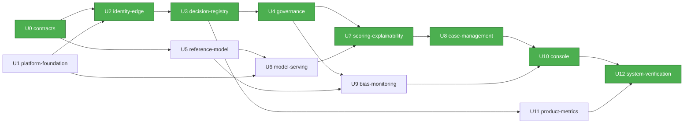

# Dependencias entre unidades — Vectra Risk

Tipos de dependencia:
- **C** = contrato (usa especificaciones y librerías de U0);
- **P** = plataforma (necesita namespaces, bases, observabilidad o Argo CD de U1);
- **I** = identidad/borde (tokens, scopes o rutas de U2);
- **R** = runtime (llama a la API de otra unidad);
- **D** = datos o artefactos (consume datasets o artefactos).

## 1. Matriz

Fila = unidad dependiente. Columna = unidad de la que depende.

| Depende de → | U0 | U1 | U2 | U3 | U4 | U5 | U6 | U7 | U8 | U9 | U10 | U11 |
|---|---|---|---|---|---|---|---|---|---|---|---|---|
| **U0 contracts** | — | | | | | | | | | | | |
| **U1 platform-foundation** | | — | | | | | | | | | | |
| **U2 identity-edge** | C (catálogo de scopes) | P | — | | | | | | | | | |
| **U3 decision-registry** | C | P | I | — | | | | | | | | |
| **U4 governance** | C | P | I | R (append) | — | | | | | R* (compare_source) | | |
| **U5 reference-model** | C (esquema de features y `MonitoringLabels`) | | | | | — | | | | | | |
| **U6 model-serving** | | P | | | | D (artefactos) | — | | | | | |
| **U7 scoring-explainability** | C | P | I | R (append, lectura) | R (serving-config) | | R (predict/explain) | — | | | | |
| **U8 case-management** | C | P | I | R (append) | | | | R (recommend) | — | | | |
| **U9 bias-monitoring** | C | P | I | R (lectura) | R (freeze) | D (modelo proxy, para pruebas) | | | | — | | |
| **U10 console** | C (cliente TS, authz) | P | I | R | R | | | R (resumen al solicitante) | R | R | — | |
| **U11 product-metrics** | C | P | I | R (lectura) | | | | | | | | — |
| **U12 system-verification** | C | P | I | R | R | D (adversarial) | R | R | R | R | R | R |

\* **Dependencia bidireccional en runtime entre U4 y U9**: governance llama a
`bias.compare_source` (F25) y bias llama a `governance.freeze` (F27). **En construcción
no hay ciclo**: ambas dependen solo del contrato publicado en U0. U4 se construye
primero; su integración con `compare_source` se prueba contra un stub generado del
OpenAPI de U9, y la prueba real se hace en U9 y en U12.

**No hay dependencias circulares en tiempo de construcción.** El grafo de §2 es acíclico.

## 2. Orden de construcción y ruta crítica (un solo equipo, Q5 = A)



En verde, la ruta crítica.

### Alternativa en texto

```
Orden secuencial (un solo equipo):
  1. U0  contracts
  2. U1  platform-foundation
  3. U2  identity-edge            (U0, U1)
  4. U3  decision-registry        (U0, U1, U2)
  5. U4  governance               (U3; stub de U9)
  6. U5  reference-model          (U0)
  7. U6  model-serving            (U1, U5)
  8. U7  scoring-explainability   (U3, U4, U6)
  9. U8  case-management          (U3, U7)
 10. U9  bias-monitoring          (U3, U4, U5)
 11. U10 console                  (U3, U4, U7, U8, U9)
 12. U11 product-metrics          (U3)
 13. U12 system-verification      (todas)

Ruta crítica: U0 -> U2 -> U3 -> U4 -> U7 -> U8 -> U10 -> U12
               (U1 en paralelo con U0; U5 -> U6 alimenta U7)
Holgura: U5/U6 pueden adelantarse tras U0/U1; U9 y U11 se pueden reordenar
         sin afectar la ruta crítica.
```

## 3. Recursos compartidos y cómo se coordinan

| Recurso | Dueño | Consumidores | Regla de coordinación |
|---|---|---|---|
| OpenAPI y tipos (`vectra_contracts`) | U0 | Todas | Versionado semántico; un cambio incompatible exige una nueva versión mayor y un PR que actualice a los consumidores |
| `vectra_common` (logger sin PII, authz, errores) | U0 | Todos los servicios Python | Ningún servicio implementa su propio logger ni su validación de JWT |
| Catálogo de scopes | U0 | U2 (realm), servicios (middleware) | U2 genera los clientes de Keycloak a partir del catálogo |
| Clústeres PostgreSQL | U1 | U2, U3, U4, U8 | U1 provee la instancia; cada unidad es dueña de su esquema, migraciones y roles de aplicación |
| Stack de observabilidad | U1 | Todas | Cada unidad versiona sus propias alertas, dashboards y runbooks junto a su chart |
| Librería de disparidad | U9 | U4 (validation-job) | Hasta que U9 exista, el validation-job de U4 se planifica contra la interfaz de U0 |
| Datasets y artefactos de referencia | U5 | U6, U9, U12 | Versionados; se referencian por hash |
| Repositorio `vectra-risk-gitops` | U1 (estructura) | Todas (values), U4 (`promotion-tool`) | Solo PR con aprobación; nunca auto-sync |
