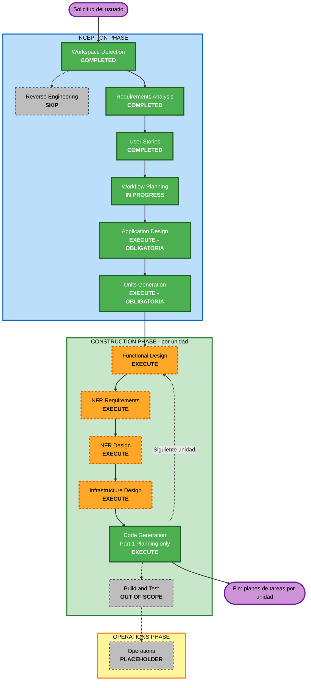

# Execution Plan — Vectra Risk

## Detailed Analysis Summary

### Transformation Scope
No aplica: el proyecto es greenfield y no hay código existente.

### Change Impact Assessment
- **User-facing changes**: Sí. Una SPA con cuatro vistas por rol, 49 historias y 6 personas.
- **Structural changes**: Sí. Arquitectura nueva de microservicios en Kubernetes: scoring, explainability, bias monitoring, Decision Registry, gateway, mock del core e IdP simulado.
- **Data model changes**: Sí. Esquemas nuevos: solicitud, recomendación, explicación, registro encadenado, versiones de modelo y de política, eventos de gobierno y métricas.
- **API changes**: Sí. Contratos OpenAPI nuevos entre servicios y hacia la SPA. El contrato scoring ↔ explicación es crítico por el fail-closed.
- **NFR impact**: Sí. Hay 4 extensiones activas: Autonomía, Security, Resiliency y PBT. Además: soberanía del dato, RPO 0 del registro, multi-zona, HPA y observabilidad dentro del clúster.

### Risk Assessment
- **Risk Level**: High. Es un dominio regulado. Un error en el fail-closed, el RBAC o el egress viola principios no negociables.
- **Rollback Complexity**: Moderate. GitOps con sync manual y el registro append-only no admite rollback de datos.
- **Testing Complexity**: Complex. Hay PBT (incluida stateful), red-teaming RT-1 a RT-5, pruebas de red y RBAC en kind y carga simulada.

### Restricción de alcance del usuario
El trabajo **se detiene al terminar el plan de tareas de cada unidad**, es decir, en Code Generation **Parte 1 (Planning)**. No se genera código. Code Generation Parte 2 y Build and Test **no se ejecutan en este trabajo**. Los planes por unidad sí incluyen los pasos de prueba y los comandos de verificación (AUTONOMIA-02, PBT-01 a 10) para que la ejecución posterior quede especificada.

---

## Workflow Visualization



### Text Alternative
```
Phase 1: INCEPTION
- Workspace Detection ........ COMPLETED
- Reverse Engineering ........ SKIP (greenfield)
- Requirements Analysis ...... COMPLETED
- User Stories ............... COMPLETED
- Workflow Planning .......... IN PROGRESS
- Application Design ......... EXECUTE (OBLIGATORIA - no omitible)
- Units Generation ........... EXECUTE (OBLIGATORIA - no omitible)

Phase 2: CONSTRUCTION (loop per unit)
- Functional Design .......... EXECUTE (per unit, may be skipped per unit)
- NFR Requirements ........... EXECUTE (per unit)
- NFR Design ................. EXECUTE (per unit)
- Infrastructure Design ...... EXECUTE (per unit)
- Code Generation ............ EXECUTE Part 1 (Planning) ONLY -> STOP
- Build and Test ............. OUT OF SCOPE (user instruction)

Phase 3: OPERATIONS
- Operations ................. PLACEHOLDER
```

---

## Entregable de este trabajo

El entregable son **las unidades de trabajo y sus planes de tareas**:

1. `aidlc-docs/inception/application-design/`: componentes, métodos, servicios y dependencias (insumo de las unidades).
2. `aidlc-docs/inception/application-design/unit-of-work.md`, `unit-of-work-dependency.md` y `unit-of-work-story-map.md`: **las unidades de trabajo**.
3. Por cada unidad, `aidlc-docs/construction/plans/{unit}-code-generation-plan.md`: **el plan de tareas**, con un criterio de aceptación ejecutable por tarea.

Application Design y Units Generation son **obligatorias** en este plan: sin ellas el entregable no existe. No se ofrecen como omitibles en ninguna etapa posterior.

---

## Phases to Execute

### 🔵 INCEPTION PHASE
- [x] Workspace Detection (COMPLETED)
- [x] Reverse Engineering (SKIPPED: greenfield)
- [x] Requirements Analysis (COMPLETED)
- [x] User Stories (COMPLETED)
- [x] Execution Plan (IN PROGRESS)
- [ ] Application Design — **EXECUTE (OBLIGATORIA, no omitible)**
  - **Por qué es obligatoria**: define los componentes que se reparten en unidades; sin ella no se pueden generar las unidades de trabajo, que son el entregable de este trabajo.
  - **Rationale adicional**: todos los componentes son nuevos. Hay que definir responsabilidades, métodos y contratos, en especial scoring ↔ explicación ↔ registro para el fail-closed. También hay que definir el contrato reemplazable de la narrativa (FR-EXP-06), las dependencias entre servicios y la clasificación de criticidad (RESILIENCY-01).
- [ ] Units Generation — **EXECUTE (OBLIGATORIA, no omitible)**
  - **Por qué es obligatoria**: produce las unidades de trabajo, que son el entregable de este trabajo. Cada plan de tareas de CONSTRUCTION se hace sobre una unidad definida aquí.
  - **Rationale adicional**: hay varios servicios, una SPA, plataforma e IaC. Hace falta descomponer el sistema en unidades con dependencias y asignarles las 49 historias.

### 🟢 CONSTRUCTION PHASE (por unidad)
- [ ] Functional Design — **EXECUTE**
  - **Rationale**: la lógica de negocio es compleja: máquina de estados del modelo, fail-closed, disparidad por bandas, reglas VIS/usura, cadena de hashes y cálculo de la North Star. PBT-01 exige identificar propiedades aquí. También hay que resolver la decisión abierta de NFR-RES-11 / US-308. Puede omitirse en unidades sin lógica de negocio (p. ej. plataforma pura), con justificación.
- [ ] NFR Requirements — **EXECUTE**
  - **Rationale**: faltan fijar la latencia objetivo, validar el SLA [INTERNO], definir el intervalo de archivado WAL, seleccionar frameworks PBT (PBT-09) y elegir el stack concreto por unidad.
- [ ] NFR Design — **EXECUTE**
  - **Rationale**: hay que diseñar patrones de circuit breaker, timeouts, reintentos con backoff, logging sin PII y tracing dentro del clúster. Aquí va la pregunta obligatoria de RESILIENCY-14.
- [ ] Infrastructure Design — **EXECUTE**
  - **Rationale**: hay que diseñar KServe, NetworkPolicies, RBAC, PostgreSQL con réplica síncrona, backups y WAL fuera del sitio, Argo CD con sync manual, HPA, Keycloak y el stack de observabilidad. Todo se entrega como manifiestos o charts vía PR (AUTONOMIA-01).
- [ ] Code Generation — **EXECUTE, solo Part 1 (Planning)**
  - **Rationale**: el usuario pidió detenerse en el plan de tareas de cada unidad. Cada plan lleva tareas con criterio de aceptación ejecutable (AUTONOMIA-02) y pasos de PBT y de ejemplo (PBT-10).
- [ ] Build and Test — **FUERA DE ALCANCE**
  - **Rationale**: es instrucción explícita del usuario ("No escribas código"). Los comandos de build y prueba quedan especificados dentro de los planes de tareas.

### 🟡 OPERATIONS PHASE
- [ ] Operations — PLACEHOLDER

---

## Secuencia de trabajo en CONSTRUCTION

Units Generation decidirá la lista final de unidades y su orden. Criterio propuesto: primero lo que otras unidades necesitan (plataforma e identidad, Decision Registry), luego la ruta crítica del fail-closed (scoring + explicación), después sesgo y gobierno, y al final la SPA y las métricas. Cada unidad completa sus etapas de diseño y su plan de tareas antes de pasar a la siguiente.

## Estimated Timeline
- **Total de etapas restantes**: 2 de INCEPTION + 5 de CONSTRUCTION por unidad (4 de diseño + plan de tareas).
- **Duración**: depende del número de unidades y de las rondas de preguntas. Cada etapa tiene su puerta de aprobación.

## Success Criteria
- **Primary Goal**: especificación completa y trazable de Vectra Risk, lista para implementarse, sin escribir código.
- **Key Deliverables**: application design; unidades con dependencias y mapa de historias; por unidad, functional design, NFR requirements, NFR design, infrastructure design y **plan de tareas** (`aidlc-docs/construction/plans/{unit}-code-generation-plan.md`).
- **Quality Gates**:
  - Cada etapa aprobada explícitamente por el usuario.
  - Cero hallazgos bloqueantes de AUTONOMIA, SECURITY, RESILIENCY y PBT en cada etapa.
  - Cada tarea de cada plan tiene un comando o prueba de verificación.
  - Ningún plan contiene `kubectl apply`, `helm install/upgrade`, `terraform apply` ni sync automático sin un paso previo de aprobación humana.
  - Las historias 🎯 de la Sesión 16 están cubiertas por tareas concretas.
